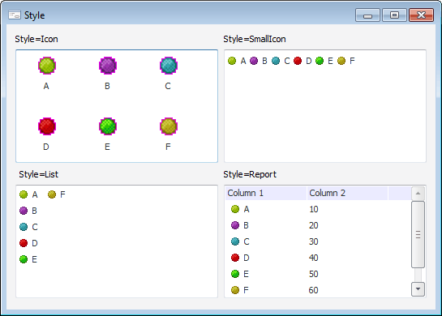

# IListView.Style

IListView.Style
-

# IListView.Style

## Синтаксис

Style: [ListViewStyle](../../Enums/ListViewStyle.htm);

## Описание

Свойство Style определяет стиль
 отображения элементов компонента.

## Пример

См. также:

[IListView](IListView.htm)

		Справочная
		 система на версию 10.9
		 от 18/08/2025,
		 © ООО «ФОРСАЙТ»,
