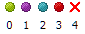
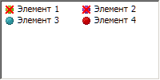

# IListViewItem.OverlayIndex

IListViewItem.OverlayIndex
-

# IListViewItem.OverlayIndex

## Синтаксис

OverlayIndex: Integer;

## Описание

Свойство OverlayIndex определяет
 индекс покрывающей маски.

## Комментарии

Покрывающая маска - это рисунок,
 расположенный над пиктограммой элемента компонента [ListView](UiDevEnv.chm::/02_Components_constructor_forms/02_Additional_components/ListView.htm).
 Для идентификации покрывающих масок используется метод [SetOverlay](../IImageList/IImageList.SetOverlay.htm).

В коллекции изображений компонента ImageList
 для выбранной пиктограммы в качестве покрывающей маски необходимо задать
 прозрачный цвет.

## Пример

Для выполнения примера предполагается наличие формы, расположенного
 на ней компонента ListView с наименованием
 «ListView1» и компонента ImageList
 с наименованием «ImageList1».

В компонент «ImageList1» загружен следующий набор изображений:

В компоненте «ListView1» создано четыре элемента. Указанная ниже процедура
 установлена в качестве обработчика события OnCreate формы.

			Sub TESTFormOnCreate(Sender: Object; Args: IEventArgs);

Var

    Items: IListViewItems;

    Item: IListViewItem;

Begin

    ImageList1.SetOverlay(ImageList1.Count - 1, 0);

    ListView1.Style := ListViewStyle.SmallIcon;

    ListView1.SmallImages := ImageList1;

    Items := ListView1.Items;

    //Первый элемент

    Item := Items.Item(0);

    Item.ImageIndex := 0;

    Item.OverlayIndex := 0;

    //Второй элемент

    Item := Items.Item(1);

    Item.ImageIndex := 1;

    Item.OverlayIndex := 0;

    //Третий элемент

    Item := Items.Item(2);

    Item.ImageIndex := 2;

    //Четвертый элемент

    Item := Items.Item(3);

    Item.ImageIndex := 3;

End Sub TESTFormOnCreate;

При запуске формы к компоненту «ListView1» в качестве источника маленьких
 пиктограмм будет подключен компонент «ImageList1». Последнему изображению
 из коллекции изображений компонента «ImageList1» будет присвоен нулевой
 индекс покрывающей маски. Данная покрывающая маска будет применена для
 первых двух элементов компонента «ListView1».

См. также:

[IListViewItem](IListViewItem.htm) | [IImageList.SetOverlay](../IImageList/IImageList.SetOverlay.htm)

		Справочная
		 система на версию 10.9
		 от 18/08/2025,
		 © ООО «ФОРСАЙТ»,
