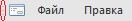
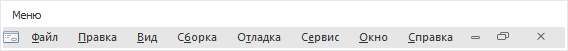

# IMainMenu.AllowUndock

IMainMenu.AllowUndock
-

# IMainMenu.AllowUndock

## Синтаксис

AllowUndock: Boolean;

## Описание

Свойство AllowUndock определяет,
 будет ли у пользователя возможность открепить меню во время выполнения
 формы.

## Комментарии

Если AllowUndock = True,
 то пользователь может открепить меню от верхней части формы и расположить
 его в любой, удобной для него, части экрана. Для того чтобы открепить
 меню, необходимо переместить курсор мыши в область меню, обозначенную
 символом: .

Далее, удерживая кнопку мыши, переместить курсор в ту область экрана,
 куда необходимо поместить меню. В результате выполнения данных действий,
 меню будет откреплено от панели и будет выглядеть, как отдельное окно:

Для того, чтобы закрепить окно с меню обратно на панель, достаточно
 переместить курсор на заголовок окна и дважды щёлкнуть.
 В случае, если AllowUndock = False, то возможность открепить
 меню будет заблокирована.

См. также:

[IMainMenu](IMainMenu.htm)

		Справочная
		 система на версию 10.9
		 от 18/08/2025,
		 © ООО «ФОРСАЙТ»,
