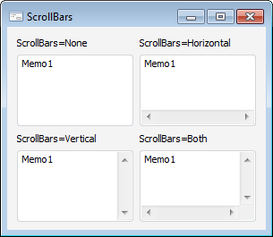

# IMemo.ScrollBars

IMemo.ScrollBars
-

# IMemo.ScrollBars

## Синтаксис

ScrollBars: [ControlScrollStyle](../../Enums/ControlScrollStyle.htm);

## Описание

Свойство ScrollBars определяет
 наличие полос прокрутки текста в поле компонента.

## Комментарии

По умолчанию ScrollBars = None.

## Пример

См. также:

[IMemo](IMemo.htm)

		Справочная
		 система на версию 10.9
		 от 18/08/2025,
		 © ООО «ФОРСАЙТ»,
