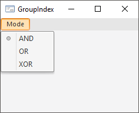

# IMenuItem.GroupIndex

IMenuItem.GroupIndex
-

# IMenuItem.GroupIndex

## Синтаксис

GroupIndex: Integer;

## Описание

Свойство GroupIndex задает индекс
 группы элементов меню.

## Комментарии

Свойство GroupIndex используется
 для создания группы элементов меню, работающих по принципу радиокнопок:
 выбор одного из элементов снимает выделение с остальных элементов меню.
 Для создания группы задайте необходимым элементам одинаковое значение
 свойства GroupIndex, а также установите
 значение True свойствам [RadioItem](IMenuItem.RadioItem.htm) и [AutoCheck](IMenuItem.AutoCheck.htm).
 Для выбранного элемента группы свойство [Checked](IMenuItem.Checked.htm)
 будет иметь значение True, для
 всех других элементов группы - False.

## Пример

Создайте форму и добавьте на неё компонент MainMenu. Создайте несколько
 элементов меню, задайте им одинаковое значение в свойстве GroupIndex,
 а также в свойствах RadioItem и AutoCheck установите значение True. При
 работе формы меню будет выглядеть следующим образом:

См. также:

[IMenuItem](IMenuItem.htm)

		Справочная
		 система на версию 10.9
		 от 18/08/2025,
		 © ООО «ФОРСАЙТ»,
