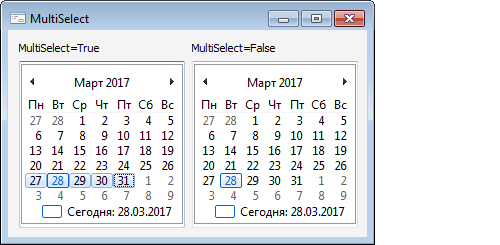

# IMonthCalendar.MultiSelect

IMonthCalendar.MultiSelect
-

# IMonthCalendar.MultiSelect

## Синтаксис

MultiSelect: Boolean;

## Описание

Свойство MultiSelect определяет
 возможность отметки диапазона дат в компоненте.

## Комментарии

Если свойству установлено значение True,
 то в компоненте можно отметить диапазон дат, иначе выделить можно только
 одну дату. Для выделения диапазона дат необходимо зажать клавишу SHIFT
 и щелкнуть по начальной и конечной дате в компоненте.
 Для получения выделенного диапазона используйте свойства [BeginDate](IMonthCalendar.BeginDate.htm)
 и [EndDate](IMonthCalendar.EndDate.htm). Максимальное количество
 дней, которые могут содержаться в выделенном диапазоне, определяется свойством
 [MaxSelectRange](IMonthCalendar.MaxSelectRange.htm).

По умолчанию свойству MultiSelect
 установлено значение False, при
 этом в компоненте доступна отметка только одной даты. Выделенную дату
 можно получить в свойстве [ICommonCalendar.CurrentDate](../ICommonCalendar/ICommonCalendar.CurrentDate.htm).

## Пример

См. также:

[IMonthCalendar](IMonthCalendar.htm)

		Справочная
		 система на версию 10.9
		 от 18/08/2025,
		 © ООО «ФОРСАЙТ»,
