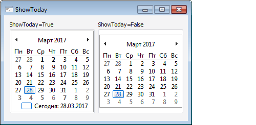

# IMonthCalendar.ShowToday

IMonthCalendar.ShowToday
-

# IMonthCalendar.ShowToday

## Синтаксис

ShowToday: Boolean;

## Описание

Свойство ShowToday определяет,
 будет ли отображаться текущая дата в нижней части календаря.

## Комментарии

Допустимые значения:

	- True. Значение по умолчанию.
	 Отображать текущую дату;

	- False. Не отображать
	 текущую дату.

## Пример

См. также:

[IMonthCalendar](IMonthCalendar.htm)

		Справочная
		 система на версию 10.9
		 от 18/08/2025,
		 © ООО «ФОРСАЙТ»,
