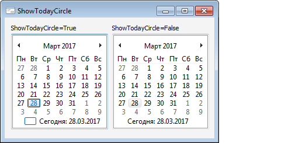

# IMonthCalendar.ShowTodayCircle

IMonthCalendar.ShowTodayCircle
-

# IMonthCalendar.ShowTodayCircle

## Синтаксис

ShowTodayCircle: Boolean;

## Описание

Свойство ShowTodayCircle определяет,
 будет ли текущая дата выделяться кружком.

## Комментарии

Допустимые значения:

	- True. Значение по умолчанию.
	 Выделять текущую дату кружком;

	- False. Не выделять текущую
	 дату кружком, подсвечивать только фон.

## Пример

См. также:

[IMonthCalendar](IMonthCalendar.htm)

		Справочная
		 система на версию 10.9
		 от 18/08/2025,
		 © ООО «ФОРСАЙТ»,
