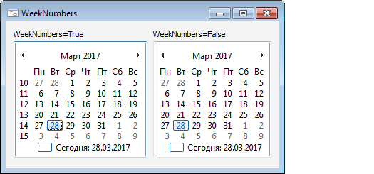

# IMonthCalendar.WeekNumbers

IMonthCalendar.WeekNumbers
-

# IMonthCalendar.WeekNumbers

## Синтаксис

WeekNumbers: Boolean;

## Описание

Свойство WeekNumbers определяет,
 будет ли отображаться нумерация недель слева от календаря.

## Комментарии

Допустимые значения:

	- True. Отображать номера
	 недель;

	- False. Значение по умолчанию.
	 Не отображать номера недель.

## Пример

См. также:

[IMonthCalendar](IMonthCalendar.htm)

		Справочная
		 система на версию 10.9
		 от 18/08/2025,
		 © ООО «ФОРСАЙТ»,
