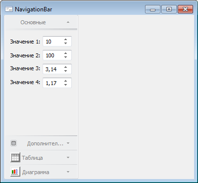

# INavigationBar.Pads

INavigationBar.Pads
-

# INavigationBar.Pads

## Синтаксис

Pads: [INavigationBarPads](../INavigationBarPads/INavigationBarPads.htm);

## Описание

Свойство Pads возвращает коллекцию
 вкладок навигационной панели.

## Пример

Для выполнения примера предполагается наличие формы, расположенного
 на ней компонента NavigationBar с наименованием «NavigationBar1» и компонента
 ImageList с наименованием «ImageList1». В компонент «ImageList1» загружены
 минимум два изображения. Также в репозитории имеются формы со следующими
 идентификаторами: «F_BASE_PARAMS», «F_ADDITION_PARAMS», «F_TABLE» и «F_DIAGRAM».
 Данные формы содержат различные группы настроек и будут подключены к панелям
 вкладок компонента «NavigationBar1».

			Class TESTForm: Form

    NavigationBar1: NavigationBar;

    ImageList1: ImageList;

    Sub TESTFormOnCreate(Sender: Object; Args: IEventArgs);

    Var

        Pads: INavigationBarPads;

        Pad: INavigationBarPad;

    Begin

        Pads := NavigationBar1.Pads;

        NavigationBar1.BeginUpdate;

        //Первая вкладка

        Pad := New NavigationBarPad.Create;

        Pads.Add(Pad);

        Pad.Header.Title := "Основные";

        Pad.Content.MetabaseObject := "F_BASE_PARAMS";

        //Вторая вкладка

        Pad := New NavigationBarPad.Create;

        Pads.Add(Pad);

        Pad.Header.Title := "Дополнительные";

        Pad.Header.Content := NavigationBarHeaderContent.CheckBox;

        Pad.Header.Value := True;

        Pad.Content.MetabaseObject := "F_ADDITION_PARAMS";

        //Третья вкладка

        Pad := New NavigationBarPad.Create;

        Pads.Add(Pad);

        Pad.Header.Title := "Таблица";

        Pad.Header.Content := NavigationBarHeaderContent.Custom;

        Pad.Header.CustomContent := CreateButton(0);

        Pad.Content.MetabaseObject := "F_TABLE";

        //Четвертая вкладка

        Pad := New NavigationBarPad.Create;

        Pads.Add(Pad);

        Pad.Header.Title := "Диаграмма";

        Pad.Header.Content := NavigationBarHeaderContent.Custom;

        Pad.Header.CustomContent := CreateButton(1);

        Pad.Content.MetabaseObject := "F_DIAGRAM";

        //Активная вкладка

        NavigationBar1.ActivePad := Pads.Item(0);

        //Границы компонента

        NavigationBar1.Border := ControlBorderType.Left Or ControlBorderType.Right;

        NavigationBar1.EndUpdate;

    End Sub TESTFormOnCreate;

    Function CreateButton(Index: Integer): IImageButton;

    Var

        Img: IImageButton;

    Begin

        Img := New ImageButton.Create;

        Img.Parent := NavigationBar1;

        Img.Enabled := False;

        Img.DrawFocus := False;

        Img.Images := ImageList1;

        Img.NormalLook.ImageIndex := Index;

        Img.Text := "";

        Img.Height := 20;

        Img.Width := 20;

        Return Img;

    End Function CreateButton;

End Class TESTForm;

При запуске формы будет настроена коллекция вкладок компонента «NavigationBar1».
 В коллекции будут созданы четыре вкладки, для каждой будет настроен заголовок
 и панель, связанная с вкладкой. У последних двух вкладок в заголовке будут
 отображены компоненты ImageButton. Первая вкладка будет активной. Также
 для компонента будут изменены границы.

Примерный вид, который может принять форма после настройки компонента
 «NavigationBar1»:

См. также:

[INavigationBar](INavigationBar.htm)

		Справочная
		 система на версию 10.9
		 от 18/08/2025,
		 © ООО «ФОРСАЙТ»,
