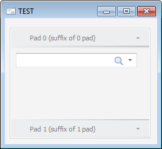

# INavigationBarHeader.TitleSuffix

INavigationBarHeader.TitleSuffix
-

# INavigationBarHeader.TitleSuffix

## Синтаксис

TitleSuffix: String;

## Описание

Свойство TitleSuffix определяет
 суффикс к тексту заголовка вкладки.

## Комментарии

Для определения текста, отображаемого в заголовке вкладки, используйте
 свойство [INavigationBarHeader.Title](INavigationBarHeader.Title.htm).

## Пример

Для выполнения примера предполагается наличие формы, расположенного
 на ней компонента NavigationBar с наименованием «NavigationBar1». Также
 в репозитории имеются формы с идентификаторами: «F_FORM1», «F_FORM2».
 Данные формы будут подключены к панелям вкладок компонента «NavigationBar1».

			Sub TESTFormOnCreate(Sender: Object; Args: IEventArgs);

Var

    Pad: INavigationBarPad;

Begin

    Pad := New NavigationBarPad.Create;

    Pad.Header.Title := "Pad " + NavigationBar1.Pads.Count.ToString;

    Pad.Header.TitleSuffix := "(suffix of " + NavigationBar1.Pads.Count.ToString + " pad)";

    Pad.Content.MetabaseObject := "DimensionCombo1";

    NavigationBar1.Pads.Add(Pad);

    Pad := New NavigationBarPad.Create;

    Pad.Header.Title := "Pad " + NavigationBar1.Pads.Count.ToString;

    Pad.Header.TitleSuffix := "(suffix of " + NavigationBar1.Pads.Count.ToString + " pad)";

    Pad.Content.MetabaseObject := "DimensionCombo2";

    NavigationBar1.Pads.Add(Pad);

End Sub TESTFormOnCreate;

При запуске формы будет настроена коллекция вкладок компонента «NavigationBar1».
 В коллекции будут созданы две вкладки, для каждой будет настроен заголовок
 и панель, связанная с вкладкой.

Примерный вид, который может принять форма после настройки компонента
 «NavigationBar1»:

См. также:

[INavigationBarHeader](INavigationBarHeader.htm)

		Справочная
		 система на версию 10.9
		 от 18/08/2025,
		 © ООО «ФОРСАЙТ»,
