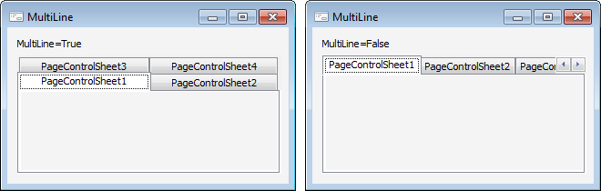

# IPageControl.MultiLine

IPageControl.MultiLine
-

# IPageControl.MultiLine

## Синтаксис

MultiLine: Boolean;

## Описание

Свойство MultiLine определяет,
 будут ли вкладки для страниц компонента размещаться в несколько рядов,
 если они не помещаются в один ряд.

## Комментарии

По умолчанию свойству установлено значение False,
 при этом вкладки расположены в один ряд. Для расположения вкладок в несколько
 рядов установите свойству значение True.

Примечание.
 Свойство всегда имеет значение True,
 если заголовки вкладок располагаются [слева/справа](IPageControl.TabPosition.htm)
 относительно самого компонента.

## Пример

См. также:

[IPageControl](IPageControl.htm)

		Справочная
		 система на версию 10.9
		 от 18/08/2025,
		 © ООО «ФОРСАЙТ»,
