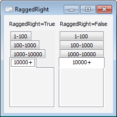

# IPageControl.RaggedRight

IPageControl.RaggedRight
-

# IPageControl.RaggedRight

## Синтаксис

RaggedRight: Boolean;

## Описание

Свойство RaggedRight определяет
 возможность изменения ширины заголовков вкладок для выравнивания их по
 правому краю компонента.

## Комментарии

Допустимые значения:

	- True. Не выравнивать
	 заголовки вкладок по правому краю, выравнивать по тексту заголовка;

	- False. Значение по умолчанию.
	 Выравнивать заголовки вкладок по правому краю.

Свойство RaggedRight актуально,
 если свойству [MultiLine](IPageControl.MultiLine.htm)
 установлено значение True.

## Пример

См. также:

[IPageControl](IPageControl.htm)

		Справочная
		 система на версию 10.9
		 от 18/08/2025,
		 © ООО «ФОРСАЙТ»,
