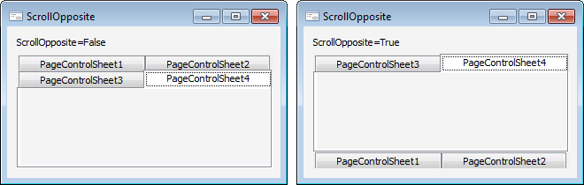

# IPageControl.ScrollOpposite

IPageControl.ScrollOpposite
-

# IPageControl.ScrollOpposite

## Синтаксис

ScrollOpposite: Boolean;

## Описание

Свойство ScrollOpposite определяет
 способ перемещения вкладок при размещении их в несколько рядов.

## Комментарии

Для размещения вкладок в несколько рядов необходимо свойству [MultiLine](IPageControl.MultiLine.htm)
 установить значение True.

По умолчанию свойству ScrollOpposite
 установлено значение False, при
 этом вкладки располагаются в месте, указанном в свойстве [TabPosition](IPageControl.TabPosition.htm).
 Если свойству установить значение True,
 то при активации вкладки все предыдущие вкладки будут располагаться в
 месте, противоположном указанному в свойстве [TabPosition](IPageControl.TabPosition.htm).

## Пример

См. также:

[IPageControl](IPageControl.htm)

		Справочная
		 система на версию 10.9
		 от 18/08/2025,
		 © ООО «ФОРСАЙТ»,
