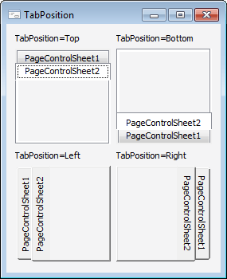

# IPageControl.TabPosition

IPageControl.TabPosition
-

# IPageControl.TabPosition

## Синтаксис

TabPosition: [TabPositionEnum](../../Enums/TabPositionEnum.htm);

## Описание

Свойство TabPosition определяет
 место расположения заголовков вкладок компонента.

Примечание.
 Если заголовки вкладок расположены слева/справа, свойству [MultiLine](IPageControl.MultiLine.htm) будет установлено значение
 True.

## Пример

См. также:

[IPageControl](IPageControl.htm)

		Справочная
		 система на версию 10.9
		 от 18/08/2025,
		 © ООО «ФОРСАЙТ»,
