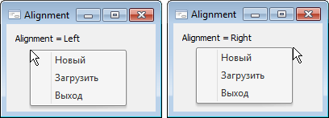

# IPopupMenu.Alignment

IPopupMenu.Alignment
-

# IPopupMenu.Alignment

## Синтаксис

Alignment: [PopupAlignment](../../Enums/PopupAlignment.htm);

## Описание

Свойство Alignment определяет,
 с какой стороны относительно курсора мыши будет появляться контекстное
 меню.

## Пример

См. также:

[IPopupMenu](IPopupMenu.htm)

		Справочная
		 система на версию 10.9
		 от 18/08/2025,
		 © ООО «ФОРСАЙТ»,
