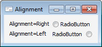

# IRadioButton.Alignment

IRadioButton.Alignment
-

# IRadioButton.Alignment

## Синтаксис

Alignment: [LeftRight](../../Enums/LeftRight.htm);

## Описание

Свойство Aligment определяет
 расположение переключателя в области компонента.

## Пример

См. также:

[IRadioButton](IRadioButton.htm)

		Справочная
		 система на версию 10.9
		 от 18/08/2025,
		 © ООО «ФОРСАЙТ»,
