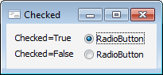

# IRadioButton.Checked

IRadioButton.Checked
-

# IRadioButton.Checked

## Синтаксис

Checked: Boolean;

## Описание

Свойство Checked определяет
 состояние переключателя.

## Комментарии

Если свойству установлено значения True,
 переключатель становится выбранным, иначе - не выбран.

## Пример

См. также:

[IRadioButton](IRadioButton.htm)

		Справочная
		 система на версию 10.9
		 от 18/08/2025,
		 © ООО «ФОРСАЙТ»,
