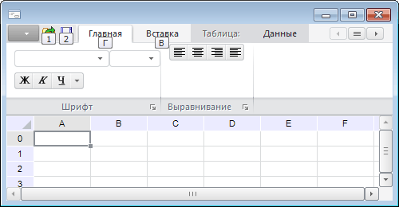

# IRibbonCategory.Keys

IRibbonCategory.Keys
-

# IRibbonCategory.Keys

## Синтаксис

Keys: String;

## Описание

Свойство Keys определяет горячую
 клавишу для быстрого доступа к вкладке на ленте инструментов.

## Комментарии

В качестве значения данного свойства необходимо указать символ, либо
 сочетание из двух символов. Символы должны соответствовать буквенной,
 либо цифровой клавише. Если указывается сочетание из двух символов, то
 ни с одной из вкладок (элементом управления) ни должна быть сопоставлена
 первая буква из сочетания.

Во время работы формы для доступа к вкладкам с помощью горячих клавиш
 необходимо нажать клавишу ALT. При этом будут отображены всплывающие подсказки
 с наименованием установленных горячих клавиш:

## Пример

Использование свойства приведено в примере для [IRibbonCategories.Add](../IRibbonCategories/IRibbonCategories.Add.htm).

См. также:

[IRibbonCategory](IRibbonCategory.htm)

		Справочная
		 система на версию 10.9
		 от 18/08/2025,
		 © ООО «ФОРСАЙТ»,
