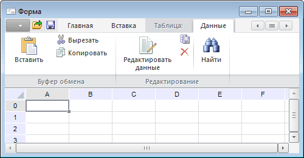

# IRibbonContext.Text

IRibbonContext.Text
-

# IRibbonContext.Text

## Синтаксис

Text: String;

## Описание

Свойство Text определяет текст
 заголовка контекстной вкладки.

## Комментарии

Заголовки контекстных вкладок отображаются в области заголовка формы
 и подсвечивается серым цветом. Заголовки вкладок, которые относятся к
 текущей контекстной вкладке, отображаются рядом.

## Пример

Пример использования приведен в описании метода [IRibbonContexts.Add](../IRibbonContexts/IRibbonContexts.Add.htm).

См. также:

[IRibbonContext](IRibbonContext.htm)

		Справочная
		 система на версию 10.9
		 от 18/08/2025,
		 © ООО «ФОРСАЙТ»,
