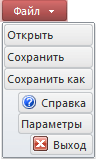

# IRibbonMainButton.Buttons

IRibbonMainButton.Buttons
-

# IRibbonMainButton.Buttons

## Синтаксис

Buttons: [IRibbonElementsCollection](../IRibbonElementsCollection/IRibbonElementsCollection.htm);

## Описание

Свойство Buttons возвращает
 коллекцию кнопок, которые будут доступны в главном меню.

## Комментарии

В данной коллекции могут быть созданы три [кнопки](../IRibbonButton/IRibbonButton.htm).
 Кнопки будут расположены ниже всех пунктов главного меню.

Примечание.
 В виду особенностей реализации при добавлении кнопок из кода, их визуальное
 расположение будет организовано снизу вверх относительно порядка добавления.
 Т.е. кнопка, созданная первой, будет расположена внизу, кнопка, созданная
 второй, будет располагаться над первой и т.д.

## Пример

Для выполнения примера предполагается наличие формы, расположенной на
 ней кнопки с наименованием «Button1», компонента Ribbon с наименованием
 «Ribbon1» и компонента ImageList с наименованием «ImageList1». В «ImageList1»
 загружены два изображения: первое - для команды «Справка», второе - для
 команды «Выход».

			Sub Button1OnClick(Sender: Object; Args: IMouseEventArgs);

Var

    MainCategory: IRibbonCategory;

    MainButton: IRibbonMainButton;

    SubItems, Buttons: IRibbonElementsCollection;

    Element: IRibbonButton;

Begin

    //Базовые параметры главного меню

    MainCategory := Ribbon1.MainCategory;

    MainCategory.SmallImages := ImageList1;

    MainCategory.Keys := "F";

    //Настройка содержимого меню

    MainButton := Ribbon1.MainButton;

    SubItems := MainButton.SubItems;

    Buttons := MainButton.Buttons;

    SubItems.Clear;

    Buttons.Clear;

    //Элементы

    //Первый пункт

    Element := New RibbonMainCategoryButton.Create;

    SubItems.Add(Element);

    Element.Text := "Открыть";

    //Второй пункт

    Element := New RibbonMainCategoryButton.Create;

    SubItems.Add(Element);

    Element.Text := "Сохранить";

    //Третий пункт

    Element := New RibbonMainCategoryButton.Create;

    SubItems.Add(Element);

    Element.Text := "Сохранить как";

    //Кнопки

    //Кнопка "Выход"

    Element := New RibbonMainCategoryButton.Create;

    Buttons.Add(Element);

    Element.Text := "Выход";

    Element.ImageIndex := 1;

    //Кнопка "Параметры"

    Element := New RibbonMainCategoryButton.Create;

    Buttons.Add(Element);

    Element.Text := "Параметры";

    //Кнопка "Справка"

    Element := New RibbonMainCategoryButton.Create;

    Buttons.Add(Element);

    Element.Text := "Справка";

    Element.ImageIndex := 0;

    Element.ImageIndex := 0;

    //Стиль кнопки приложения

    MainButton.ColorStyle := RibbonMainButtonColorStyle.Red;

    MainButton.Text := "Файл";

End Sub Button1OnClick;

При нажатии на кнопку будет сформировано главное меню ленты. Меню будет
 выглядеть примерно следующим образом:

См. также:

[IRibbonMainButton](IRibbonMainButton.htm)

		Справочная
		 система на версию 10.9
		 от 18/08/2025,
		 © ООО «ФОРСАЙТ»,
