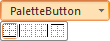
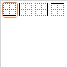

# IRibbonPaletteButton.ButtonMode

IRibbonPaletteButton.ButtonMode
-

# IRibbonPaletteButton.ButtonMode

## Синтаксис

ButtonMode: Boolean;

## Описание

Свойство ButtonMode определяет
 режим работы кнопки.

## Комментарии

Если свойству установлено значение True,
 то кнопка будет работать в обычном режиме, т.е. на панели будет отображен
 элемент управления - Кнопка, с правой стороны кнопки будет отображен треугольник.
 При нажатии на кнопку будет появляться комбинированное меню. Меню состоит
 из основного набора графических кнопок, и дополнительных элементов управления,
 которые связаны с данной кнопкой:

Если свойству установлено значение False,
 то кнопка не будет отображаться на ленте. Основной набор графических кнопок
 будет сгруппирован и отображен на панели. В данной группе также будет
 присутствовать кнопка «Больше», при нажатии на которую будет отображено
 комбинированное меню, включающее основные графические кнопки и дополнительные
 элементы управления:

## Пример

Для выполнения примера предполагается наличие формы, расположенной на
 ней кнопки с наименованием «Button1», компонента Ribbon
 с наименованием «Ribbon1» и компонента ImageList
 с наименованием «PaletteImg». На ленте компонента «Ribbon1» создана вкладка
 и панель. В «PaletteImg» загружено одно большое изображение, ширина которого
 кратна 20.

			Sub Button1OnClick(Sender: Object; Args: IMouseEventArgs);

Var

    RPanel: IRibbonPanel;

    RPalette: IRibbonPaletteButton;

    ChildElements: IRibbonElementsCollection;

    ChildButton: IRibbonButton;

Begin

    RPanel := Ribbon1.ActiveCategory.Panels.Item(0);

    RPalette := New RibbonPaletteButton.Create;

    RPanel.Elements.Add(RPalette);

    RPalette.ButtonMode := True;

    RPalette.ColumnCount := 4;

    RPalette.Images := PaletteImg;

    RPalette.IconWidth := 20;

    RPalette.ResizeList := RibbonPaletteResize.Both;

    RPalette.Text := "Пиктограммы";

    ChildElements := RPalette.SubItems;

    ChildButton := New RibbonButton.Create;

    ChildElements.Add(ChildButton);

    ChildButton.Text := "Добавить";

    ChildButton.ImageIndex := 0;

End Sub Button1OnClick;

При нажатии на кнопку на панели ленты будет создана кнопка для вызова
 комбинированного меню. Основной набор графических кнопок будет сформирован
 из отдельных изображений, полученных путем разбивки изображения компонента
 «PaletteImg» на отдельные изображения размером 20 пикселей в ширину. Также
 после основного набора графических кнопок будет добавлена дополнительная
 кнопка.

См. также:

[IRibbonPaletteButton](IRibbonPaletteButton.htm)

		Справочная
		 система на версию 10.9
		 от 18/08/2025,
		 © ООО «ФОРСАЙТ»,
