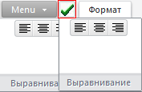

# IRibbonPanel.ImageIndex

IRibbonPanel.ImageIndex
-

# IRibbonPanel.ImageIndex

## Синтаксис

ImageIndex: Integer;

## Описание

Свойство ImageIndex определяет
 индекс изображения, которое будет связано с панелью.

## Комментарии

Источник изображений устанавливается в свойстве [Images](../IRibbon/IRibbon.Images.htm)
 для ленты.

Изображение, установленное в данном свойстве, отображается в следующих
 случаях:

	- Для панели создан ярлык на [панели
	 быстрого доступа](../IRibbonQuickAccessToolbar/IRibbonQuickAccessToolbar.htm).

	- Панель отображается в свёрнутом виде. Панели отображаются в
	 свёрнутом виде, если размеры формы не позволяют полностью отобразить
	 все элементы управления, сформированные для компонента [Ribbon](UiDevEnv.chm::/02_Components_constructor_forms/02_Additional_components/Ribbon.htm).
	 При этом посередине каждой панели будет отображена кнопка, для которой
	 будет использовано изображение с индексом ImageIndex.

При нажатии ярлыка, либо кнопки посередине панели, будут отображены
 все элементы управления панели. Источник изображений для данного свойства
 устанавливается в свойстве [Images](../IRibbon/IRibbon.Images.htm)
 компонента [Ribbon](UiDevEnv.chm::/02_Components_constructor_forms/02_Additional_components/Ribbon.htm):

## Пример

Пример использования приведен в описании метода [IRibbonPanels.Add](../IRibbonPanels/IRibbonPanels.Add.htm).

См. также:

[IRibbonPanel](IRibbonPanel.htm)

		Справочная
		 система на версию 10.9
		 от 18/08/2025,
		 © ООО «ФОРСАЙТ»,
