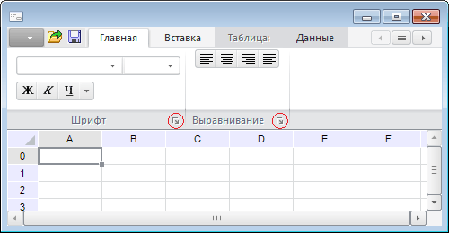

# IRibbonPanel.LaunchButton

IRibbonPanel.LaunchButton
-

# IRibbonPanel.LaunchButton

## Синтаксис

LaunchButton: [IRibbonButton](../IRibbonButton/IRibbonButton.htm);

## Описание

Свойство LaunchButton возвращает
 параметры кнопки запуска, расположенной на панели.

## Комментарии

Кнопка запуска располагается в правом нижнем углу панели. Кнопка может
 использоваться для запуска каких-либо пользовательских форм, назначение
 и функциональность которых связана с данной панелью.

Нажатие на кнопку запуска, также как и использование различных элементов
 управления, приведет к генерации события [Ribbon.OnChange](../../Class/Ribbon/Ribbon.OnChange.htm).
 В данном событии можно выполнить необходимые действия, связанные с кнопкой
 запуска.

## Пример

Пример использования приведен в описании метода [IRibbonPanels.Add](../IRibbonPanels/IRibbonPanels.Add.htm).

См. также:

[IRibbonPanel](IRibbonPanel.htm)

		Справочная
		 система на версию 10.9
		 от 18/08/2025,
		 © ООО «ФОРСАЙТ»,
