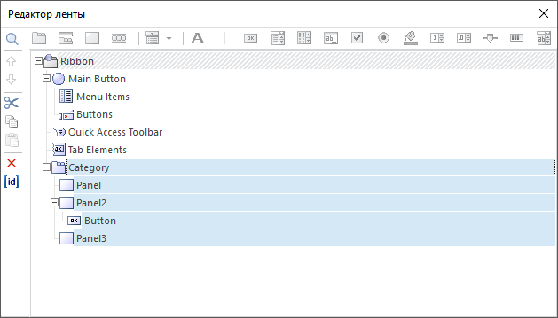
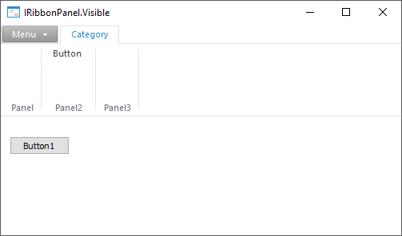
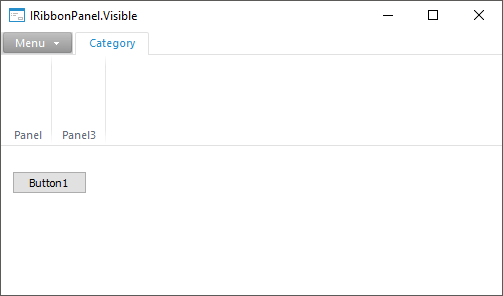

# IRibbonPanel.Visible

IRibbonPanel.Visible
-

# IRibbonPanel.Visible

## Синтаксис

Visible: Boolean;

## Описание

Свойство Visible определяет
 отображение панели.

## Комментарии

Допустимые значения:

	- True. По умолчанию.
	 Панель отображается на ленте инструментов;

	- False. Панель не отображается
	 на ленте инструментов.

## Пример

Для выполнения примера предполагается наличие формы с [компонентами](UiDevEnv.chm::/01_Development_Environment/02_Work_in_Development_Environment/Accomodation_component_on_form.htm):

	- [Button](UiDevEnv.chm::/02_Components_constructor_forms/01_Standart_Components/Button.htm). Кнопка
	 с наименованием Button1 для скрытия панели на ленте инструментов;

	- [Ribbon](UiDevEnv.chm::/02_Components_constructor_forms/02_Additional_components/Ribbon.htm). Компонент
	 с наименованием Ribbon1 для создания ленты инструментов с помощью
	 [редактора
	 ленты](UiDevEnv.chm::/02_Components_constructor_forms/02_Additional_components/Ribbon_Designer.htm).

Примечание.
 При создании компонента будет открыто окно выбора ресурсов. Выберите для
 компонента пустой объект «Ресурсы»,
 в котором будут храниться графические ресурсы элементов ленты инструментов.

Сформируйте структуру ленты инструментов
 в [редакторе
 ленты](UiDevEnv.chm::/02_Components_constructor_forms/02_Additional_components/Ribbon_Designer.htm):

		- Добавьте категорию.

		- Добавьте три панели.

		- Добавьте кнопку на вторую панель.

После выполнения действий структура ленты
 инструментов в редакторе ленты примет вид:

После добавления компонентов форма примет вид:

Добавьте ссылку на системную сборку Forms.

Пример является обработчиком события OnClick для компонента с наименованием
 Button1.

			Sub Button1OnClick(Sender: Object; Args: IMouseEventArgs);

Begin

    If (RibbonPanel2.Visible = True) Then

        RibbonPanel2.Visible := False;

    Else

        RibbonPanel2.Visible := True;

    End If;

End Sub Button1OnClick;

В результате выполнения примера при нажатии на кнопку «Button1»
 будет скрыта вторая панель на ленте инструментов:

При втором нажатии на кнопку «Button1»
 вторая панель на ленте инструментов будет отображена.

См. также:

[IRibbonPanel](IRibbonPanel.htm)

		Справочная
		 система на версию 10.9
		 от 18/08/2025,
		 © ООО «ФОРСАЙТ»,
