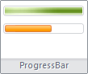

# IRibbonProgressBar.Mode

IRibbonProgressBar.Mode
-

# IRibbonProgressBar.Mode

## Синтаксис

Mode: [RibbonProgressBarMode](../../Enums/RibbonProgressBarMode.htm);

## Описание

Свойство Mode определяет режим
 отображения индикатора компонента.

## Комментарии

Для компонента доступны два режима отображения индикатора: обычный () и бесконечный ().

Визуальное отображение переливающегося индикатора в бесконечном режиме
 доступно при использовании следующих тем оформления:

	- Microsoft Office 2007;

	- Microsoft Office 2010;

	- Carbon;

	- Windows 7 (при использовании операционной системы Windows 7
	 и включенной темы оформления Aero);

	- Тема оформления платформы.

## Пример

Для выполнения примера предполагается наличие формы, расположенного
 на ней компонента Ribbon с наименованием «Ribbon1», компонента Timer с
 наименованием «Timer1» и двух кнопок с наименованиями «Button1» и «Button2».
 Кнопки будут использованы для активации и деактивации таймера. В компонент
 «Ribbon1» загружена лента. На первой панели активной вкладки ленты расположены
 два индикатора процесса.

			Class TestForm: Form

    Ribbon1: Ribbon;

    Button1: Button;

    Button2: Button;

    Timer1: Timer;

    Progress1, Progress2: IRibbonProgressBar;

    i: Integer;

    Const MaxValue = 100;

    Sub TestFormOnCreate(Sender: Object; Args: IEventArgs);

    Var

        RPanel: IRibbonPanel;

    Begin

        RPanel := Ribbon1.ActiveCategory.Panels.Item(0);

        Progress1 := RPanel.Elements.Item(0) As IRibbonProgressBar;

        Progress2 := RPanel.Elements.Item(1) As IRibbonProgressBar;

        Progress1.Mode := RibbonProgressBarMode.Infinite;

        Progress2.Mode := RibbonProgressBarMode.Normal;

        Progress1.Maximum := MaxValue;

        Progress2.Maximum := MaxValue;

    End Sub TestFormOnCreate;

    Sub Button1OnClick(Sender: Object; Args: IMouseEventArgs);

    Begin

        Timer1.Enabled := True;

    End Sub Button1OnClick;

    Sub Button2OnClick(Sender: Object; Args: IMouseEventArgs);

    Begin

        Timer1.Enabled := False;

    End Sub Button2OnClick;

    Sub Timer1OnTimer(Sender: Object; Args: IEventArgs);

    Begin

        If i = MaxValue Then

            i := 0;

        End If;

        i := i + 1;

        Progress1.Value := i;

        Progress2.Value := i;

    End Sub Timer1OnTimer;

End Class TestForm;

После запуска формы при нажатии на кнопку «Button1» будет активирован
 таймер. В событии таймера изменяется значение, отображаемое на индикаторах
 процесса. При использовании темы оформления Carbon визуально процесс будет
 выглядеть следующим образом:

См. также:

[IRibbonProgressBar](IRibbonProgressBar.htm)

		Справочная
		 система на версию 10.9
		 от 18/08/2025,
		 © ООО «ФОРСАЙТ»,
