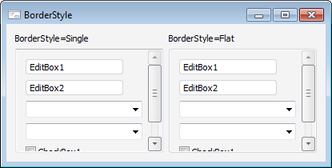

# IScrollBox.BorderStyle

IScrollBox.BorderStyle
-

# IScrollBox.BorderStyle

## Синтаксис

BorderStyle: [ControlBorderStyle](../../Enums/ControlBorderStyle.htm);

## Описание

Свойство BorderStyle определяет
 стиль границы компонента.

## Пример

См. также:

[IScrollBox](IScrollBox.htm)

		Справочная
		 система на версию 10.9
		 от 18/08/2025,
		 © ООО «ФОРСАЙТ»,
