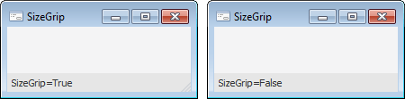

# IStatusBar.SizeGrip

IStatusBar.SizeGrip
-

# IStatusBar.SizeGrip

## Синтаксис

SizeGrip: Boolean;

## Описание

Свойство SizeGrip определяет,
 будет ли в компоненте отображаться кнопка изменения размеров окна.

## Комментарии

Допустимые значения:

	- True. Отображать кнопку
	 изменения размера;

	- False. Значение по умолчанию.
	 Не отображать кнопку изменения размера.

Примечание.
 Наличие/отсутствие кнопки изменения размеров окна не влияет на фактическое
 наличие данной функции. На возможность изменения размеров окна влияет
 свойство формы [IFormControl.BorderStyle](../IFormControl/IFormControl.BorderStyle.htm).

## Пример

См. также:

[IStatusBar](IStatusBar.htm)

		Справочная
		 система на версию 10.9
		 от 18/08/2025,
		 © ООО «ФОРСАЙТ»,
