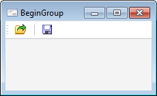

# IToolbarButton.BeginGroup

IToolbarButton.BeginGroup
-

# IToolbarButton.BeginGroup

## Синтаксис

BeginGroup: Boolean;

## Описание

Свойство BeginGroup позволяет
 разделить группы компонентов, расположенных на панели инструментов, визуально
 вертикальной чертой.

## Комментарии

Если свойству установлено значение True,
 то слева от кнопки будет отображаться вертикальная разделительная черта.

## Пример

См. также:

[IToolbarButton](IToolbarButton.htm)

		Справочная
		 система на версию 10.9
		 от 18/08/2025,
		 © ООО «ФОРСАЙТ»,
