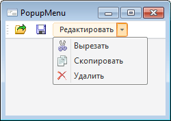

# IToolbarButton.PopupMenu

IToolbarButton.PopupMenu
-

# IToolbarButton.PopupMenu

## Синтаксис

PopupMenu: [IPopupMenu](../IPopupMenu/IPopupMenu.htm);

## Описание

Свойство PopupMenu определяет
 контекстное меню, связанное с текущей кнопкой панели инструментов.

## Комментарии

При установке данного свойства, справа от кнопки на панели инструментов
 будет отображаться дополнительная кнопка , при нажатии
 которой будет отображаться контекстное меню.

## Пример

См. также:

[IToolbarButton](IToolbarButton.htm) | [IToolbarButton.MenuMode](IToolbarButton.MenuMode.htm)

		Справочная
		 система на версию 10.9
		 от 18/08/2025,
		 © ООО «ФОРСАЙТ»,
