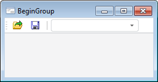

# IToolbarComboBox.BeginGroup

IToolbarComboBox.BeginGroup
-

# IToolbarComboBox.BeginGroup

## Синтаксис

BeginGroup: Boolean;

## Описание

Свойство BeginGroup позволяет
 разделить группы компонентов, расположенных на панели инструментов, визуально
 вертикальной чертой.

## Комментарии

Если свойству установлено значение True,
 то слева от комбинированного списка будет отображаться вертикальная разделительная
 черта.

## Пример

См. также:

[IToolbarComboBox](IToolbarComboBox.htm)

		Справочная
		 система на версию 10.9
		 от 18/08/2025,
		 © ООО «ФОРСАЙТ»,
