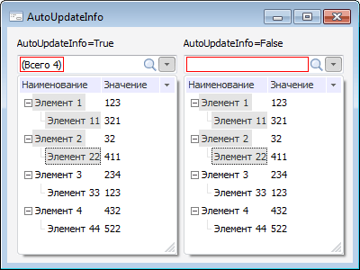

# ITreeCombo.AutoUpdateInfo

ITreeCombo.AutoUpdateInfo
-

# ITreeCombo.AutoUpdateInfo

## Синтаксис

AutoUpdateInfo: Boolean;

## Описание

Свойство AutoUpdateInfo определяет
 признак автоматического обновления информации об отметке в редакторе компонента.

## Комментарии

Если свойству установлено значения True,
 то при изменении отметки будет производиться автоматическое обновление
 информации об отметке в редакторе компонента. Если свойству установлено
 значение False, то информация
 об отметке обновится после вызова метода [UpdateInfo](ITreeCombo.UpdateInfo.htm).

## Пример

См. также:

[ITreeCombo](ITreeCombo.htm) | [ITreeCombo.UpdateInfo](ITreeCombo.UpdateInfo.htm)

		Справочная
		 система на версию 10.9
		 от 18/08/2025,
		 © ООО «ФОРСАЙТ»,
