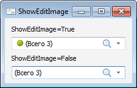

# ITreeCombo.ShowEditImage

ITreeCombo.ShowEditImage
-

# ITreeCombo.ShowEditImage

## Синтаксис

ShowEditImage: Boolean;

## Описание

Свойство ShowEditImage определяет
 признак отображения пиктограммы элемента в редакторе компонента.

## Комментарии

Допустимые значения:

	- True. Отображать пиктограмму
	 первого выделенного элемента;

	- False. Не отображать
	 пиктограмму первого выделенного элемента.

Свойство актуально, если установлено свойство [Images](../ITreeControl/ITreeControl.Images.htm)
 или [StateImages](../ITreeControl/ITreeControl.StateImages.htm).

По умолчанию в редакторе компонента выводится наименование выделенного
 элемента или общее количество выделенных элементов при множественной отметке.
 Также в свойстве [ITreeCombo.CustomMultiselectTextTemplate](ITreeCombo.CustomMultiselectTextTemplate.htm)
 может быть определен собственный шаблон для текста, выводимого в редакторе
 компонента.

Примечание.
 Для компонента [MetabaseTreeCombo](UiDevEnv.chm::/02_Components_constructor_forms/02_Additional_components/MetabaseTreeCombo.htm),
 являющегося наследником компонента [TreeCombo](UiDevEnv.chm::/02_Components_constructor_forms/02_Additional_components/TreeCombo.htm), данное свойство не поддерживается. В редакторе компонента
 [MetabaseTreeCombo](UiDevEnv.chm::/02_Components_constructor_forms/02_Additional_components/MetabaseTreeCombo.htm)
 всегда отображается пиктограмма выделенного элемента (первого выделенного
 элемента при множественной отметке).

## Пример

См. также:

[ITreeCombo](ITreeCombo.htm)

		Справочная
		 система на версию 10.9
		 от 18/08/2025,
		 © ООО «ФОРСАЙТ»,
