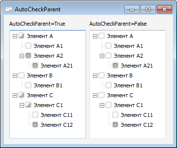

# ITreeControl.AutoCheckParent

ITreeControl.AutoCheckParent
-

# ITreeControl.AutoCheckParent

## Синтаксис

AutoCheckParent: Boolean;

## Описание

Свойство AutoCheckParent определяет,
 будет ли у родительских вершин компонента автоматически устанавливаться
 неопределенное состояние ([CheckState](../ITreeListNode/ITreeListNode.CheckState.htm)
 = Indeterminate), если отмечены не все дочерние вершины.

## Комментарии

Свойство актуально, если свойству [Checkboxes](ITreeControl.Checkboxes.htm)
 установлено значение True.

Допустимые значения:

	- True. Если у вершины
	 отмечены не все дочерние вершины, то для этой вершины выставляется
	 неопределенное состояние флажка;

	- False. Значение по умолчанию.
	 Все вершины имеют независимую отметку флажка.

## Пример

См. также:

[ITreeControl](ITreeControl.htm)

		Справочная
		 система на версию 10.9
		 от 18/08/2025,
		 © ООО «ФОРСАЙТ»,
