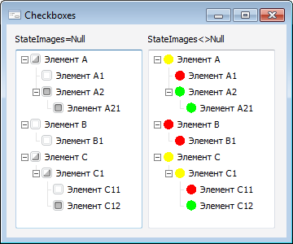

# ITreeControl.Checkboxes

ITreeControl.Checkboxes
-

# ITreeControl.Checkboxes

## Синтаксис

Checkboxes: Boolean;

## Описание

Свойство Checkboxes определяет
 признак наличия флажков у элементов компонента.

## Комментарии

Допустимые значения:

	- True. Для элементов
	 отображаются флажки;

	- False. Значение
	 по умолчанию. Флажки для элементов не отображаются.

Если для компонента установлено свойство [StateImages](ITreeControl.StateImages.htm)
 и Checkboxes = True,
 то для отображения состояния флажков элементов будут использоваться первые
 три изображения из коллекции [StateImages](ITreeControl.StateImages.htm):
 изображение с индексом 0 для не отмеченных, с индексом 1 для отмеченных
 и с индексом 2 для флажков, имеющих неопределенное состояние.

Если для компонента установлены свойства SelectionMode
 = SingleSelected и CheckBoxes
 = True, то изменение состояния флажка осуществляется при нажатии
 клавиши ПРОБЕЛ, когда фокус находится на нужной вершине. При смене состояний
 флажков будут генерироваться события [OnChecking](ITreeControl.OnChecking.htm)
 и [OnChecked](ITreeControl.OnChecked.htm).

## Пример

См. также:

[ITreeControl](ITreeControl.htm)

		Справочная
		 система на версию 10.9
		 от 18/08/2025,
		 © ООО «ФОРСАЙТ»,
