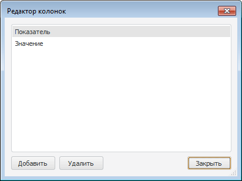

# ITreeControl.Columns

ITreeControl.Columns
-

# ITreeControl.Columns

## Синтаксис

Columns: [ITreeListColumns](../ITreeListColumns/ITreeListColumns.htm);

## Описание

Свойство Соlumns возвращает
 коллекцию столбцов компонента.

## Комментарии

Добавление колонок осуществляется в специальном редакторе. Окно «Редактор колонок» вызывается при
 щелчке кнопки  свойства Соlumns
 компонентов [TreeList](UiDevEnv.chm::/02_Components_constructor_forms/02_Additional_components/TreeList.htm)
 и [TreeCombo](UiDevEnv.chm::/02_Components_constructor_forms/02_Additional_components/TreeCombo.htm)
 в [Инспекторе
 объектов](UiDevEnv.chm::/01_Development_Environment/03_Windows_of_Development_Environment/Object_Inspector.htm):

В окне «Редактор колонок» расположено
 три кнопки:

	- Добавить.
	 Добавляет новый столбец в компонент;

	- Удалить. Удаляет
	 текущий выделенный столбец;

	- Закрыть. Закрывает
	 окно редактора.

См. также:

[ITreeControl](ITreeControl.htm)

		Справочная
		 система на версию 10.9
		 от 18/08/2025,
		 © ООО «ФОРСАЙТ»,
