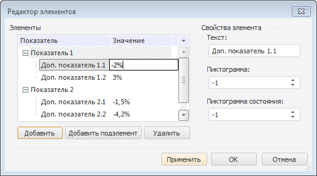
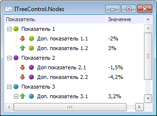

# ITreeControl.Nodes

ITreeControl.Nodes
-

# ITreeControl.Nodes

## Синтаксис

Nodes: [ITreeListNodes](../ITreeListNodes/ITreeListNodes.htm);

## Описание

Свойство Nodes возвращает коллекцию
 элементов компонента.

## Комментарии

Добавление элементов и редактирование их свойств осуществляется в окне
 «Редактор элементов». Для открытия
 данного окна следует:

	- выбрать пункт контекстного меню «Элементы»
	 для компонента, расположенного на форме;

	- нажать на кнопку 
	 свойства Nodes в инспекторе
	 объектов;

	- дважды щёлкните по свойству Nodes
	 в инспекторе объектов.

Каждый элемент может содержать текст, пиктограмму и пиктограмму состояния.
 Если в компоненте содержится более одной колонки, то для редактирования
 значения элемента в другой колонке необходимо осуществить одиночный щелчок
 мыши на пересечении выбранного элемента и нужной колонки. По истечению
 нескольких секунд будет открыто окно редактирования значения.

Примечание.
 Длина текста в каждой колонке не должна превышать 5450 символов.

Для отображения рядом с наименованием элементов пиктограмм
 сначала необходимо для компонента в свойстве [Images](ITreeControl.Images.htm)
 выбрать компонент [ImageList](UiDevEnv.chm::/02_Components_constructor_forms/02_Additional_components/ImageBox.htm)
 или [GlobalImageList](UiDevEnv.chm::/02_Components_constructor_forms/02_Additional_components/GlobalImageList.htm).
 Индекс пиктограммы, отображаемой рядом с элементом, выбирается в поле
 редактирования «Пиктограмма» редактора
 элементов, либо может быть задан в свойстве [ImageIndex](../ITreeListNode/ITreeListNode.ImageIndex.htm)
 через прикладной код.

Также для каждого элемента можно добавить вторую пиктограмму, позволяющую
 отображать дополнительное состояние элемента (Пиктограмма
 состояния). Для этого у компонента сначала задается свойство [StateImages](ITreeControl.StateImages.htm). Затем индекс
 изображений указывается в поле «Пиктограмма
 состояния» или в свойстве [StateIndex](../ITreeListNode/ITreeListNode.StateIndex.htm)
 через прикладной код.

## Пример

См. также:

[ITreeControl](ITreeControl.htm)

		Справочная
		 система на версию 10.9
		 от 18/08/2025,
		 © ООО «ФОРСАЙТ»,
