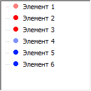

# ITreeListNode.Cut

ITreeListNode.Cut
-

# ITreeListNode.Cut

## Синтаксис

Cut: Boolean;

## Описание

Свойство Cut определяет, будет ли элемент отмечен как вырезанный.

## Комментарии

Cut не копирует элемент в буфер обмена и не удаляет его из списка, поэтому эти операции должно производить приложение. Если свойству Cut установлено значение True, то пиктограмма элемента будет иметь более светлый вид, сигнализируя о том, что элемент был вырезан.

«Элемент 1» и «Элемент 4» помечены как вырезанные.

См. также:

[ITreeListNode](ITreeListNode.htm)

		Справочная
		 система на версию 10.9
		 от 18/08/2025,
		 © ООО «ФОРСАЙТ»,
