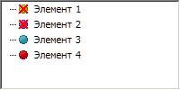

# ITreeListNode.OverlayIndex

ITreeListNode.OverlayIndex
-

# ITreeListNode.OverlayIndex

## Синтаксис

OverlayIndex: Integer;

## Описание

Свойство OverlayIndex определяет
 индекс покрывающей маски.

## Комментарии

Покрывающая маска - это рисунок,
 расположенный над пиктограммой элемента компонента. Для идентификации
 покрывающих масок используется метод [SetOverlay](../IImageList/IImageList.SetOverlay.htm).

В коллекции изображений компонента ImageList
 для выбранной пиктограммы в качестве покрывающей маски необходимо задать
 прозрачный цвет.

## Пример

Для выполнения примера предполагается наличие формы, расположенного
 на ней компонента TreeList с наименованием
 «TreeList1» и компонента ImageList
 с наименованием «ImageList1».

В компонент «ImageList1» загружен следующий набор изображений:

В компоненте «TreeList1» создано четыре вершины. Указанная ниже процедура
 установлена в качестве обработчика события OnCreate формы.

			Sub TestFormOnCreate(Sender: Object; Args: IEventArgs);

Var

    Node: ITreeListNode;

Begin

    //Последнее изображение из коллекции будет использоваться в качестве покрывающей маски

    //Индекс, назначаемый покрывающей маске - 0

    ImageList1.SetOverlay(ImageList1.Count - 1, 0);

    TreeList1.Images := ImageList1;

    //Первая вершина

    Node := TreeList1.Nodes.FirstNode;

    Node.ImageIndex := 0;

    Node.OverlayIndex := 0;

    //Вторая вершина

    Node := Node.NextNode;

    Node.ImageIndex := 1;

    Node.OverlayIndex := 0;

    //Третья вершина

    Node := Node.NextNode;

    Node.ImageIndex := 2;

    //Четвертая вершина

    Node := Node.NextNode;

    Node.ImageIndex := 3;

End Sub TestFormOnCreate;

При запуске формы к компоненту «TreeList1» в качестве источника пиктограмм
 будет подключен компонент «ImageList1». Последнему изображению из коллекции
 изображений компонента «ImageList1» будет присвоен нулевой индекс покрывающей
 маски. Данная покрывающая маска будет применена для первых двух элементов
 компонента «TreeList1».

См. также:

[ITreeListNode](ITreeListNode.htm) | [IImageList.SetOverlay](../IImageList/IImageList.SetOverlay.htm)

		Справочная
		 система на версию 10.9
		 от 18/08/2025,
		 © ООО «ФОРСАЙТ»,
