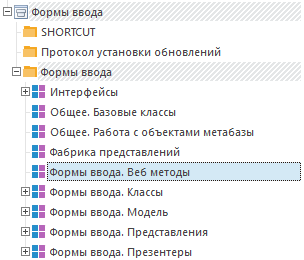

# Работа с формами ввода: Веб-сервис

Работа с формами ввода: Веб-сервис
-

**

# Работа с формами ввода

Для работы с формами ввода через веб-сервис предварительно должно быть
 [установлено](Setup.chm::/Extensions/install_or_update_extensions.htm)
 само расширение «Интерактивные формы ввода данных». После установки в
 корневой папке репозитория будет создана папка «Компоненты», в ней компонент
 «Формы ввода», в котором будет доступна сборка «Формы ввода. Веб методы»:

В компоненте форм ввода реализованы
 следующие модули, содержащие веб-методы:

	- [Методы по работе с формой ввода](UNIT_WEB_METHODS_INPUT_FORM.htm)
	 (UNIT_WEB_METHODS_INPUT_FORM);

	- [Методы по работе с табличной
	 областью](UNIT_WEB_METHODS_TABLE_AREA.htm) (UNIT_WEB_METHODS_TABLE_AREA);

	- [Дополнительные
	 методы для работы с формой ввода](UNIT_WEB_METHODS.htm) (UNIT_WEB_METHODS).

Именно из этих модулей и будет осуществляться вызов процедур и функций
 с помощью операции [ForeExec](../../Operations/Repository/ForeExec.htm).
 Большинство методов, работающих с существующей формой ввода, имеют в своей
 сигнатуре параметр с типом IPrxReport. В качестве значения данного параметра
 необходимо передавать моникёр регламентного отчёта, являющегося дочерним
 объектом формы ввода. Получить дочерний регламентный отчёт можно с помощью
 операции [GetObjects](../../Operations/Repository/GetObjects.htm),
 а открыть регламентный отчёт и получить его моникёр можно с помощью операции
 [OpenPrx](../../Operations/RegularReport/OpenPrx.htm).

## Пример

Ниже приведён пример поэтапного создания новой формы ввода, получения
 её регламентного отчёта и сохранение изменений в репозитории.
 В примере C# используется функция FindObjectById,
 код которой приведен в примере «[Получение
 описания объекта по его идентификатору](../../Operations/Repository/GetObjects_Sample/GetObjects_Sample.htm)».

Создание новой формы ввода:

	 SOAP
	  JSON C#

### SOAP-запрос:

<s:Envelope xmlns:s="http://schemas.xmlsoap.org/soap/envelope/**">
<s:Body xmlns:xsi="**http://www.w3.org/2001/XMLSchema-instance**" xmlns:xsd="**http://www.w3.org/2001/XMLSchema**">
<ForeExec xmlns="**http://www.fsight.ru/PP.SOM.Som**">
<tFore xmlns="****">
  <id>S1!M!241984</id>  </tFore>
<tArg xmlns="****">
  <methodName>CreateDataEntryForm</methodName><args>
<it>
  <k>1</k>  <value>Новая форма ввода</value>  </it>
<it>
  <k>2</k>  <value>NewDataEntryForms</value>  </it>
<it>
  <k>3</k>  <value>262316</value>  </it>
  </args>
  </tArg>
  </ForeExec>
  </s:Body>
  </s:Envelope>

### SOAP-ответ:

<soapenv:Envelope xmlns:soapenv="**http://schemas.xmlsoap.org/soap/envelope/**">
<soapenv:Body>
<ForeExecResult xmlns="**http://www.fsight.ru/PP.SOM.Som**" xmlns:q1="**http://www.fsight.ru/PP.SOM.Som**" xmlns:xsi="**http://www.w3.org/2001/XMLSchema-instance**">
  <result xmlns="****">272356</result>  </ForeExecResult>
  </soapenv:Body>
  </soapenv:Envelope>

### JSON-запрос:

{
 "ForeExec" :
  {
   "tFore" :
    {
     "id" : "S1!M!241984"
    },
   "tArg" :
    {
     "methodName" : "CreateDataEntryForm",
     "args" :
      {
       "it" :
        [
          {
           "k" : "1",
           "value" : "Новая форма ввода"
          },
          {
           "k" : "2",
           "value" : "NewDataEntryForms"
          },
          {
           "k" : "3",
           "value" : "262316"
          }
        ]
      }
    }
  }
}

### JSON-ответ:

{
 "ForeExecResult" :
  {
   "result" : "272356"
  }
}

public static ForeExecResult DEFMethodExecute(MbId mb, string methodName, OdArg[] methodArgs)
{
    var somClient = new SomPortTypeClient(); //Прокси-объект для выполнения операций
    //Параметры выполнения операции
    var tExec = new ForeExec()
    {
        tArg = new ForeExecArg()
        {
            methodName = methodName,
            args = methodArgs
        },
        //Моникёр объекта среды разработки с реализацией метода
        tFore = new ForeId()
        {
            id = mb.id + "!" + FindObjectById(mb, "UNIT_WEB_METHODS_INPUT_FORM").k
        }
    };
    //Выполнение метода
    var result = somClient.ForeExec(tExec);
    return result;
}

Получение дочернего регламентного отчёта:

	 SOAP
	  JSON C#

### SOAP-запрос:

<s:Envelope xmlns:s="**http://schemas.xmlsoap.org/soap/envelope/**">
<s:Body xmlns:xsi="**http://www.w3.org/2001/XMLSchema-instance**" xmlns:xsd="**http://www.w3.org/2001/XMLSchema**">
<GetObjects xmlns="**http://www.fsight.ru/PP.SOM.Som**">
<tParent xmlns="****">
  <id>S1!M!272356</id>  </tParent>
<tFilter xmlns="****">
<classes>
<it>
  <k>2562</k>  </it>
  </classes>
  </tFilter>
<tArg xmlns="****">
  <pattern />
  <path>Children</path>  </tArg>
  </GetObjects>
  </s:Body>
  </s:Envelope>

### SOAP-ответ:

<soapenv:Envelope xmlns:soapenv="**http://schemas.xmlsoap.org/soap/envelope/**">
<soapenv:Body>
<GetObjectsResult xmlns="**http://www.fsight.ru/PP.SOM.Som**" xmlns:q1="**http://www.fsight.ru/PP.SOM.Som**" xmlns:xsi="**http://www.w3.org/2001/XMLSchema-instance**">
<id xmlns="****">
  <id>S1!M!272356</id>  </id>
<objects xmlns="****">
<its>
<d isShortcut="**0**" isLink="**0**" hf="**0**">
  <i>NEWDATAENTRYFORMS_REPORT</i>  <n>Новая форма ввода: Базовый отчет</n>  <k>272357</k>  <c>2562</c>  
272356
  <h>0</h>  <hasPrv>0</hasPrv>  <ic>0</ic>  </d>
  </its>
  </objects>
  </GetObjectsResult>
  </soapenv:Body>
  </soapenv:Envelope>

### JSON-запрос:

{
 "GetObjects" :
  {
   "tParent" :
    {
     "id" : "S1!M!272356"
    },
   "tFilter" :
    {
     "classes" :
      {
       "it" :
        {
         "k" : "2562"
        }
      }
    },
   "tArg" :
    {
     "pattern" : "",
     "path" : "Children"
    }
  }
}

### JSON-ответ:

{
 "GetObjectsResult" :
  {
   "id" :
    {
     "id" : "S1!M!272356"
    },
   "objects" :
    {
     "its" :
      {
       "d" :
        {
         "@isShortcut" : "0",
         "@isLink" : "0",
         "@hf" : "0",
         "i" : "NEWDATAENTRYFORMS_REPORT",
         "n" : "Новая форма ввода: Базовый отчет",
         "k" : "272357",
         "c" : "2562",
         "p" : "272356",
         "h" : "0",
         "hasPrv" : "0",
         "ic" : "0"
        }
      }
    }
  }
}

public static Od GetDEFReport(MbId mb, string dataformKey)
{
    var somClient = new SomPortTypeClient(); //Прокси-объект для выполнения операций
    //Параметры выполнения операции
    var tObject = new GetObjects()
    {
        //Параметры фильтрации объектов
        tArg = new GetObjectsArg()
        {
            pattern = new OdsPattern(),
            path = MbObjectsPath.Children
        },
        tFilter = new OdsFilt()
        {
            classes = new OdClass[1] { new OdClass() { k = 2562 } } //MetabaseObjectClass.KE_CLASS_PROCEDURALREPORT
        },
        //
        tParent = new OdId()
        {
            id = mb.id + "!" + dataformKey
        }
    };
    //Получение дочернего регламентного отчёта
    var result = somClient.GetObjects(tObject);
    return result.objects.its[0];
}

Сохранение изменений формы ввода:

	 SOAP
	  JSON C#

### SOAP-запрос:

<s:Envelope xmlns:s="**http://schemas.xmlsoap.org/soap/envelope/**">
<s:Body xmlns:xsi="**http://www.w3.org/2001/XMLSchema-instance**" xmlns:xsd="**http://www.w3.org/2001/XMLSchema**">
<ForeExec xmlns="**http://www.fsight.ru/PP.SOM.Som**">
<tFore xmlns="****">
  <id>S1!M!241984</id>  </tFore>
<tArg xmlns="****">
  <methodName>SaveDataEntryForm</methodName><args>
<it>
  <k>1</k>  <value>S1!M!S!P2</value>  </it>
  </args>
  </tArg>
  </ForeExec>
  </s:Body>
  </s:Envelope>

### SOAP-ответ:

<soapenv:Envelope xmlns:soapenv="**http://schemas.xmlsoap.org/soap/envelope/**">
<soapenv:Body>
<ForeExecResult xmlns="**http://www.fsight.ru/PP.SOM.Som**" xmlns:q1="**http://www.fsight.ru/PP.SOM.Som**" xmlns:xsi="**http://www.w3.org/2001/XMLSchema-instance**">
  <result xmlns="****" />
  </ForeExecResult>
  </soapenv:Body>
  </soapenv:Envelope>

### JSON-запрос:

{
 "ForeExec" :
  {
   "tFore" :
    {
     "id" : "S1!M!241984"
    },
   "tArg" :
    {
     "methodName" : "SaveDataEntryForm",
     "args" :
      {
       "it" :
        {
         "k" : "1",
         "value" : "S1!M!S!P2"
        }
      }
    }
  }
}

### JSON-ответ:

{
 "ForeExecResult" :
  {
   "result" : ""
  }
}

public static ForeExecResult DEFMethodExecute(MbId mb, string methodName, OdArg[] methodArgs)
{
    var somClient = new SomPortTypeClient(); //Прокси-объект для выполнения операций
    //Параметры выполнения операции
    var tExec = new ForeExec()
    {
        tArg = new ForeExecArg()
        {
            methodName = methodName,
            args = methodArgs
        },
        //Моникёр объекта среды разработки с реализацией метода
        tFore = new ForeId()
        {
            id = mb.id + "!" + FindObjectById(mb, "UNIT_WEB_METHODS_INPUT_FORM").k
        }
    };
    //Выполнение метода
    var result = somClient.ForeExec(tExec);
    return result;
}

См. также:

[Взаимодействие
 с расширениями](../Extension_Services.htm)

		Справочная
		 система на версию 10.9
		 от 18/08/2025,
		 © ООО «ФОРСАЙТ»,
