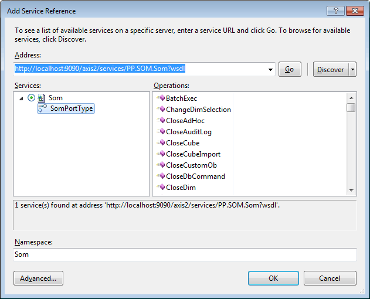

# Использование веб-сервиса в проектах, разрабатываемых в Microsoft Visual Studio

Использование веб-сервиса в проектах, разрабатываемых в Microsoft Visual Studio
-

# Использование веб-сервиса в проектах, разрабатываемых в Microsoft Visual
 Studio

Для использования веб-сервиса необходимо в разрабатываемом проекте добавить
 на него ссылку. Для этого в среде разработки Visual Studio выполните команду
 главного меню «Project/Add Service Reference»
 (либо одноименную команду контекстного меню, вызываемого для проекта в
 обозревателе проекта).

В открывшемся диалоге необходимо указать адрес к wsdl установленного
 BI-сервера. Формат адреса представлен в [базовом
 описании](PP7Service_Using.htm) по подключению к веб-сервису. В поле Namespace
 необходимо указать наименование пространства имен, которое будет сгенерировано
 для проекта и будет использоваться для доступа к ресурсам веб-сервиса.
 После этого нажмите кнопку «Go».
 При удачном подключении отобразится наименование доступного веб-сервиса
 и список его операций. Нажмите кнопку «ОК».
 В структуру проекта будут добавлены папка «System Reference», в которой
 расположена ссылка на созданное пространство имен, и файл App.config.
 На основании содержимого wsdl-файла в указанном пространстве имен будут
 сгенерированы типы, которые будут использоваться для написания кода по
 работе с веб-сервисом.

Примечание.
 Для использования типов в коде добавьте директиву Using:
 using <ProjectName>.<ServiceNamespace>;

Среди всех типов будет присутствовать прокси-класс SomPortTypeClient
 при подключении к BI-серверу. Данный класс реализует методы, которые выполняют
 одноименные операции веб-сервиса. Все операции условно можно разделить
 по блокам комплекса, для которых они предназначены. Описание операций
 представлено в разделе «[Операции
 веб-сервиса](../Operations/BaseService.htm)».

## Настройка файла App.config

Файл App.config содержит конфигурационные
 элементы, которые управляют работой приложения. Содержимое файла представлено
 в XML-формате, описание структуры файла имеется в MSDN. После подключения
 к веб-сервису в данном файле будут сгенерированы:

	- конечная точка, содержащая URL-адрес для подключения к веб-сервису;

	- настройки, используемые при работе с конечной точкой.

В файле App.config необходимо
 произвести следующие изменения:

	- В разделе <system.serviceModel><client>...
	 </client></system.serviceModel> будет присутствовать
	 элемент <endpoint>...</endpoint>,
	 содержащий параметры конечной точки подключения к веб-сервису. По
	 умолчанию для этой точки будет сгенерирован следующий адрес: http://localhost:9090/axis2/services/PP.SOM.Som.
	 Его необходимо исправить, указав корректный адрес и порт BI-сервера.

	- В разделе <system.serviceModel><bindings>...
	 </bindings></system.serviceModel> будет добавлен
	 элемент <basicHttpBinding>...</basicHttpBinding>,
	 содержащий настройки, используемые при работе с конечной точкой. Во
	 время работы операций веб-сервиса объемы формируемых запросов и получаемых
	 ответов будут превышать размеры, указанные в данных настройках по
	 умолчанию. Поэтому целесообразно сразу изменить настройки, увеличив
	 значения в следующих атрибутах:

		- maxBufferSize и
		 maxReceivedMessageSize
		 (должны иметь одинаковое значение).

		- maxNameTableCharCount.

См. также:

[Подключение
 к веб-сервису](PP7Service_Using.htm)

		Справочная
		 система на версию 10.9
		 от 18/08/2025,
		 © ООО «ФОРСАЙТ»,
