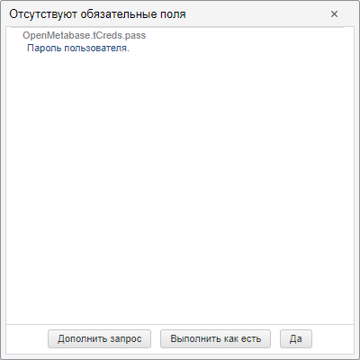

# Консоль веб-сервиса

Консоль веб-сервиса
-

# Консоль веб-сервиса

Консоль веб-сервиса - это веб-приложение,
 предназначенное для прикладных веб-разработчиков с целью ознакомления
 со структурой операций веб-сервиса и их возможностями.

Основные функции консоли:

	- просмотр структуры запросов и ответов каждой операции в форматах
	 XML или JSON;

	- формирование собственного запроса в соответствии с выполняемым
	 действием и имеющимися параметрами;

	- выполнение сформированного запроса и получение ответа.

## Установка

Консоль веб-сервиса устанавливается вместе с [серверной
 частью веб-приложения](Setup.chm::/UiWebSetup/03_Setup_Web/WebSetup_Setup.htm) с помощью инсталлятора [FP10WebServer.exe](Setup.chm::/02_AK_Install/DistributionKit.htm).
 После установки серверной части веб-приложения также необходимо развернуть
 BI-сервер с помощью одного из [доступных инсталляторов](Setup.chm::/02_AK_Install/DistributionKit.htm).
 Данному BI-серверу будут направляться запросы при выполнении операций
 в консоли веб-сервиса. Адрес BI-сервера пропишите в файле [PP.xml](Setup.chm::/UiWebSetup/03_Setup_Web/PP_config_Java.htm)
 в разделе <service>.

После установки консоль будет доступна по адресу http://localhost/FP_App_v10.x/Wsc/Index.html.

Примечание.
 Для корректной работы консоли веб-сервиса проверьте наличие зарегистрированных
 типов MIME для расширений .json и .xml. Если какой-либо тип отсутствует,
 то добавьте его: для расширения .json тип MIME - application/json; для
 расширения .xml тип MIME - text/xml.

## Работа в консоли веб-сервиса

Все операции разбиты по функциональному назначению и доступны на отдельных
 вкладках слева. При выборе вкладки и необходимой операции её скрипт будет
 загружен в редактор. Для всех полей будут установлены значения полей по
 умолчанию. При щелчке в редакторе по наименованию операции или какого-либо
 поля будет произведён поиск описания. Найденное описание будет раскрыто
 и подсвечено в области «Описание».
 Также при щелчке по какому-либо описанию производится поиск и подсвечивание
 соответствующего поля в структуре запроса. Если поле из запроса было удалено,
 то в описании будет доступна кнопка «+»,
 позволяющая вставить поле в запрос.

Удалив в редакторе поля, которые не должны использоваться, и задав значения
 для нужных полей, нажмите кнопку «Выполнить»
 для выполнения операции. Если в запросе заданы не все обязательные поля,
 то будет выведен диалог следующего вида:

Нажатие кнопки «Дополнить запрос»
 позволяет в нужном месте дополнить запрос обязательными полями. После
 задания значений этих полей повторно нажмите кнопку «Выполнить».
 Кнопка «Выполнить как есть» позволяет
 выполнить запрос без указания обязательных полей. Кнопка «Да»
 закрывает диалог без каких-либо последующих действий.

Если выполнение операции прошло успешно, то ниже запроса в отдельной
 области будет отображен ответ веб-сервиса. Значения, доступные в ответе,
 могут использоваться при выполнении других операций. Если при выполнении
 операции возникла какая-либо ошибка, то ниже редактора с запросом в области
 «Reply error» будет указан текст
 ошибки.

## Дополнительные возможности

Консоль содержит дополнительные кнопки, выполняющие следующие действия:

	- Форматировать. Позволяет
	 отформатировать запрос, созданный в каком-либо внешнем редакторе и
	 вставленный в консоль.

	- Очистить. Позволяет
	 очистить поле редактора запроса.

	- Развернуть все. Позволяет
	 раскрыть все иерархии полей, имеющих дочерние поля.

	- Свернуть все. Позволяет
	 свернуть все иерархии полей, имеющих дочерние поля.

	- XML/JSON. Изменение
	 формата представления запроса.

Поле «Поиск» позволяет осуществить
 сквозной поиск полей среди всех операций. При наборе наименования поля/операции
 будет составлен список из полных путей до найденного элемента среди всего
 списка доступных полей/операций. При выборе необходимого пути запрос операции
 будет загружен в редактор и искомое поле будет сфокусировано и подсвечено.

Примечание.
 Так как структуры операций могут включать в себя сотни, а иногда и тысячи
 полей, то поиск может занять длительное время.

В области запроса и ответа также доступен поиск по тексту запроса/ответа
 текущей отображаемой операции. Для поиска установите курсор в область
 запроса/ответа и нажмите сочетание горячих клавиш CTRL+F или F3. В открывшемся
 диалоге введите искомый текст. После небольшой задержки осуществляется
 поиск и подсветка найденных значений. С помощью клавиш навигации  и  можно перемещаться между
 найденными полями.

Примечание.
 Если сочетание горячих клавиш CTRL+F или F3 нажато вне области запроса/ответа,
 то будет отображен диалог для поиска средствами браузера. Данный поиск
 осуществляется только по видимой части запроса/ответа или текста со справкой.

Поле «Фильтр» позволяет отфильтровать
 список описаний, отображаемых в области «Описание».
 При наборе текста в данной области будут скрыты все описания, в которых
 отсутствует введенный текст.

См. также:

[Операции
 веб-сервиса](../Operations/BaseService.htm) | [Параметры
 строки адреса консоли веб-сервиса](WSC/WSC_URL_Parameters.htm)

		Справочная
		 система на версию 10.9
		 от 18/08/2025,
		 © ООО «ФОРСАЙТ»,
