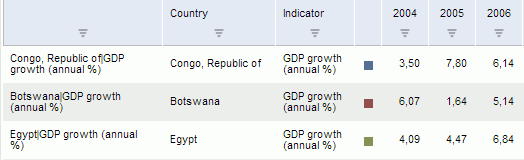

# Отображение дополнительных столбцов со значениями атрибутов

Отображение дополнительных столбцов со значениями атрибутов
-

**

# Отображение дополнительных столбцов со значениями атрибутов

Ниже приведен пример использования операции [SetWbkMd](../SetWbkMd.htm) для отображения дополнительных
 столбцов со значениями атрибутов и сортировки данных в рабочей книге по
 наименованиям рядов. В запросе передаются: экземпляр открытой рабочей
 книги; изменяемые параметры отображения столбцов и сортировки данных;
 шаблоны изменения и извлечения данных. В ответе приходят запрошенные данные.

	 SOAP  JSON C#

### SOAP-запрос:

<s:Envelope xmlns:s="http://schemas.xmlsoap.org/soap/envelope/**">
<s:Body xmlns:xsi="**http://www.w3.org/2001/XMLSchema-instance**" xmlns:xsd="**http://www.w3.org/2001/XMLSchema**">
<SetWbkMd xmlns="**http://www.fsight.ru/PP.SOM.Som**">
<tWbk xmlns="****">
  <id>S1!M!S!W6</id>  </tWbk>
<tArg xmlns="****">
  <refresh />
<pattern>
  <obInst>true</obInst>  <sorting>true</sorting>  <useGridAutoAdjust>true</useGridAutoAdjust>  <columns>Add</columns>  <columnsFilter />
  </pattern>
<meta>
<columns>
<its>
<it>
  <k>0</k>  <type>Database</type>  <readOnly>true</readOnly><db>
  <text>Name</text>  </db>
  <customTitle>Источник данных</customTitle>  </it>
<it>
  <k>0</k>  <type>Attribute</type>  <readOnly>false</readOnly><att>
  <namingFormat />
<att hasMultipleValues="**false**">
  <k>5</k>  <id>UNIT</id>  <n>Единица измерения</n>  <vis>false</vis><valuesObj isShortcut="**false**" isLink="**false**" ds="****" ver="**0**" hf="**false**">
  <i>UNITS_D</i>  <n>Единицы Измерения</n>  <k>174</k>  <c>3076</c>  
159
  <h>false</h>  <hasPrv>false</hasPrv>  <ic>false</ic>  <trackElementDependents>false</trackElementDependents>  </valuesObj>
  <dt>2</dt>  <predefined>true</predefined>  <nullable>true</nullable>  <primary>false</primary><unitsObj isShortcut="**false**" isLink="**false**" ds="****" ver="**0**" hf="**false**">
  <i>UNITS</i>  <n>Единицы измерения</n>  <k>5483</k>  <c>1033</c>  
5472
  <h>false</h>  <hasPrv>false</hasPrv>  <ic>false</ic>  <trackElementDependents>false</trackElementDependents>  </unitsObj>
  <defaultValue />
  <dataDomain>0</dataDomain>  <isInHierarchyByDefault>false</isInHierarchyByDefault>  <orderInHierarchyByDefault>0</orderInHierarchyByDefault><filterInHierarchyByDefault>
  <k>174</k>  <id>UNITS_D</id>  <n>Единицы Измерения</n>  <vis>true</vis>  </filterInHierarchyByDefault>
  </att>
  </att>
  </it>
  </its>
  <fullHints>false</fullHints>  </columns>
<sorting>
<header>
<its>
<it direction="**Asc**">
<col>
  <k>0</k>  <id>NAME</id>  </col>
  </it>
  </its>
  </header>
  </sorting>
  </meta>
<metaGet>
  <obInst>true</obInst>  <useGridAutoAdjust>true</useGridAutoAdjust>  </metaGet>
  </tArg>
  </SetWbkMd>
  </s:Body>
  </s:Envelope>

### SOAP-ответ:

<soapenv:Envelope xmlns:soapenv="**http://schemas.xmlsoap.org/soap/envelope/**">
<soapenv:Body>
<SetWbkMdResult xmlns="**http://www.fsight.ru/PP.SOM.Som**" xmlns:q1="**http://www.fsight.ru/PP.SOM.Som**" xmlns:xsi="**http://www.w3.org/2001/XMLSchema-instance**">
  <refresh xmlns="****" />
<id xmlns="****">
  <id>S1!M!S!W6</id>  </id>
<meta xmlns="****">
<obInst>
<obDesc ds="****" isShortcut="**0**" isLink="**0**" ver="**1**" hf="**0**">
  <i>WBK_AD_COLUMNS</i>  <n>Годовые данные с доп. столбцами</n>  <k>5528</k>  <c>2827</c>  
5471
  <h>0</h>  <hasPrv>0</hasPrv>  <ic>0</ic>  <trackElementDependents>0</trackElementDependents>  <isPermanent>1</isPermanent>  <isTemp>0</isTemp>  </obDesc>
  </obInst>
  <dirty>1</dirty>  <windowsPosition>Vertical</windowsPosition>  <hasPivot>0</hasPivot>  <hasLaner>1</hasLaner><series count="**3**">
  <its />
  </series>
  </meta>
  </SetWbkMdResult>
  </soapenv:Body>
  </soapenv:Envelope>

### JSON-запрос:

{
 "SetWbkMd" :
  {
   "tWbk" :
    {
     "id" : "S1!M!S!W6"
    },
   "tArg" :
    {
     "refresh" : "",
     "pattern" :
      {
       "obInst" : "true",
       "sorting" : "true",
       "useGridAutoAdjust" : "true",
       "columns" : "Add",
       "columnsFilter" : ""
      },
     "meta" :
      {
       "columns" :
        {
         "its" :
          {
           "it" :
            [
              {
               "k" : "0",
               "type" : "Database",
               "readOnly" : "true",
               "db" :
                {
                 "text" : "Name"
                },
               "customTitle" : "Источник данных"
              },
              {
               "k" : "0",
               "type" : "Attribute",
               "readOnly" : "false",
               "att" :
                {
                 "namingFormat" : "",
                 "att" :
                  {
                   "@hasMultipleValues" : "false",
                   "k" : "5",
                   "id" : "UNIT",
                   "n" : "Единица измерения",
                   "vis" : "false",
                   "valuesObj" :
                    {
                     "@ds" : "",
                     "@isShortcut" : "false",
                     "@isLink" : "false",
                     "@ver" : "0",
                     "@hf" : "false",
                     "i" : "UNITS_D",
                     "n" : "Единицы Измерения",
                     "k" : "174",
                     "c" : "3076",
                     "p" : "159",
                     "h" : "false",
                     "hasPrv" : "false",
                     "ic" : "false",
                     "trackElementDependents" : "false"
                    },
                   "dt" : "2",
                   "predefined" : "true",
                   "nullable" : "true",
                   "primary" : "false",
                   "unitsObj" :
                    {
                     "@ds" : "",
                     "@isShortcut" : "false",
                     "@isLink" : "false",
                     "@ver" : "0",
                     "@hf" : "false",
                     "i" : "UNITS",
                     "n" : "Единицы измерения",
                     "k" : "5483",
                     "c" : "1033",
                     "p" : "5472",
                     "h" : "false",
                     "hasPrv" : "false",
                     "ic" : "false",
                     "trackElementDependents" : "false"
                    },
                   "defaultValue" : "",
                   "dataDomain" : "0",
                   "isInHierarchyByDefault" : "false",
                   "orderInHierarchyByDefault" : "0",
                   "filterInHierarchyByDefault" :
                    {
                     "k" : "174",
                     "id" : "UNITS_D",
                     "n" : "Единицы Измерения",
                     "vis" : "true"
                    }
                  }
                }
              }
            ]
          },
         "fullHints" : "false"
        },
       "sorting" :
        {
         "header" :
          {
           "its" :
            {
             "it" :
              [
                {
                 "@direction" : "Asc",
                 "col" :
                  {
                   "k" : "0",
                   "id" : "NAME"
                  }
                }
              ]
            }
          }
        }
      },
     "metaGet" :
      {
       "obInst" : "true",
       "useGridAutoAdjust" : "true"
      }
    }
  }
}

### JSON-ответ:

{
 "SetWbkMdResult" :
  {
   "refresh" : "",
   "id" :
    {
     "id" : "S1!M!S!W6"
    },
   "meta" :
    {
     "obInst" :
      {
       "obDesc" :
        {
         "@ds" : "",
         "@isShortcut" : "0",
         "@isLink" : "0",
         "@ver" : "1",
         "@hf" : "0",
         "i" : "WBK_AD_COLUMNS",
         "n" : "Годовые данные с доп. столбцами",
         "k" : "5528",
         "c" : "2827",
         "p" : "5471",
         "h" : "0",
         "hasPrv" : "0",
         "ic" : "0",
         "trackElementDependents" : "0",
         "isPermanent" : "1",
         "isTemp" : "0"
        }
      },
     "dirty" : "1",
     "windowsPosition" : "Vertical",
     "hasPivot" : "0",
     "hasLaner" : "1",
     "series" :
      {
       "@count" : "3",
       "its" : ""
      }
    }
  }
}

public static SetWbkMdResult SetWbkColumns(WbkId wbk, RubAtt att)
{// Задаём параметры выполнения операции
    var tOp = new SetWbkMd
    {
        tWbk = wbk,
        tArg = new SetWbkMdArg
        {   // Задаём шаблон изменения данных
            pattern = new WbkMdPattern
            {
                columns = ListOperation.Add,
                columnsFilter = new ListFilter(),
                sorting = true
            },
            // Задаём изменяемые данные
            meta = new WbkMd()
            {// Задаём отображаемые столбцы
                columns = new LnColumns()
                {
                    fullHints = false,
                    its = new LnColumn[]
                    {// Столбец, отображающий информацию об источнике данных
                        new LnColumn()
                        {
                            readOnly = true,
                            type = LnColumnType.Database,
                            db = new LnColumnDatabase()
                            {
                                text = LnDatabaseColumnText.Name
                            },
                            customTitle = "Источник данных"
                        },// Столбец, отображающий значения указанного атрибута
                        new LnColumn()
                        {
                            type = LnColumnType.Attribute,
                            readOnly = false,
                            att = new LnColumnAtt()
                            {
                                namingFormat = "",
                                rubKey = null,
                                att = att
                            }
                        }
                    }
                },// Задаём параметры сортировки данных
                sorting = new LnSorting()
                {
                    header = new LnHeaderSorting()
                    {
                        its = new LnHeaderColSort[]
                        {// Задаём параметры сортировки по наименованиям рядов
                            new LnHeaderColSort()
                            {
                                col = new ItEntity()
                                {id = "NAME"},
                                direction = SortDirection.Asc,
                                directionSpecified = true
                            }
                        }
                    }
                }
            },
            // Задаём шаблон извлечения и обновления изменённых данных
            metaGet = new WbkMdPattern() { },
            refresh = new EaxRefresh() { }
        }
    };
    // Создаем прокси-объект для выполнения операции
    var somClient = new SomPortTypeClient();
    // Выполнение операции
    var sRes = somClient.SetWbkMd(tOp);
    return sRes;
}

Пример таблицы данных, отображающей дополнительные столбцы «Country»
 и «Indicator» со значениями атрибутов

См. также:

[SetWbkMd:
 Операция](../SetWbkMd.htm)

		Справочная
		 система на версию 10.9
		 от 18/08/2025,
		 © ООО «ФОРСАЙТ»,
