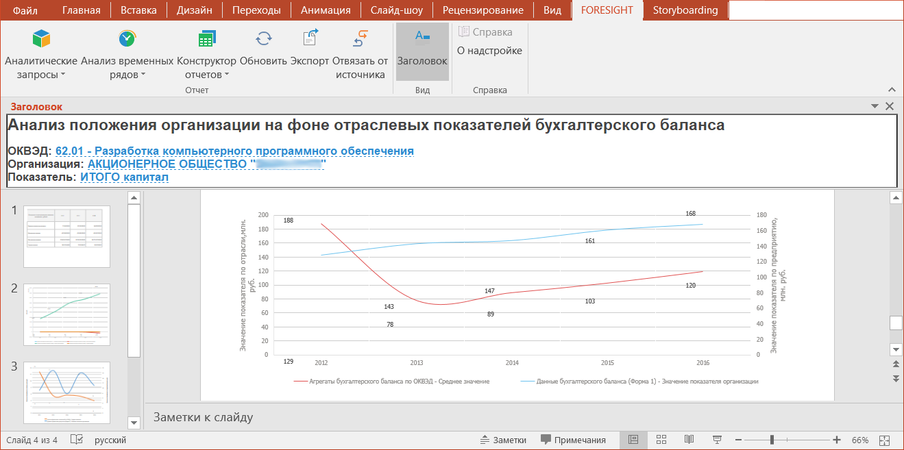

# Построение презентаций с использованием надстройки Foresight Add-in for PowerPoint

Построение презентаций с использованием надстройки Foresight Add-in for PowerPoint
-

# Построение презентаций с использованием надстройки Foresight
 Add-in for PowerPoint

Для расширения возможностей приложения Microsoft PowerPoint используйте
 надстройку Foresight
 Add-in for PowerPoint:

Надстройка Foresight
 Add-in for PowerPoint - устанавливаемый компонент, который позволяет добавить
 новые возможности к приложению Microsoft PowerPoint.

Примечание.
 Поддерживаются версии Microsoft Office 2016, Microsoft Office 2019​​.

С помощью надстройки можно создавать презентации с использованием данных,
 содержащихся в репозитории платформы.

Ключевые возможности:

	- подключение к источникам данных из репозитория платформы;

	- вставка в презентацию:

		- элементов для отображения данных в табличной, графической
		 форме или в виде карты;

		- вычисляемых элементов, рассчитывающих значения на основе
		 данных из источника или по пользовательской формуле;

	- открытие существующих отчетов;

	- экспорт созданного документа;

	- выполнение пакетных операций.

Для начала работы смотрите статью
 «[Начало работы
 с надстройкой Foresight
 Add-in for PowerPoint](AddIn_Mode.htm)».

Для построения презентаций смотрите
 статью «[Построение
 презентации с использованием надстройки](Work/PowerPoint_Work.htm)».

См. также:

[Начало
 работы с надстройкой Foresight
 Add-in for PowerPoint](AddIn_Mode.htm) | [Построение
 презентации с использованием надстройки](Work/PowerPoint_Work.htm)

		Справочная
		 система на версию 10.9
		 от 18/08/2025,
		 © ООО «ФОРСАЙТ»,
