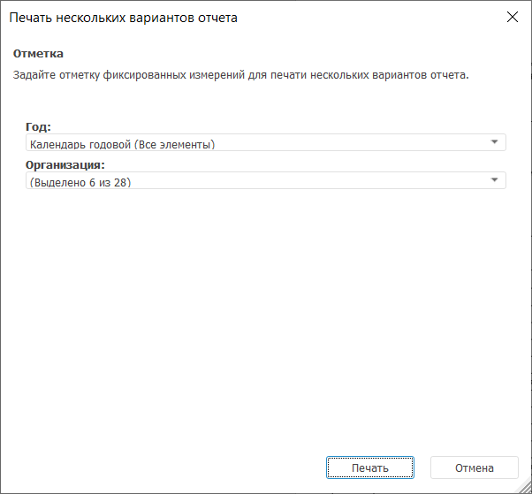
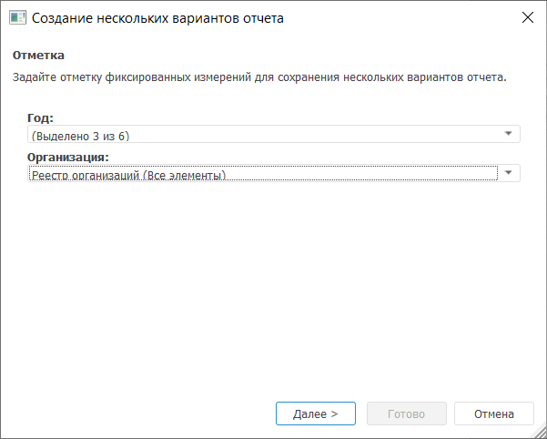
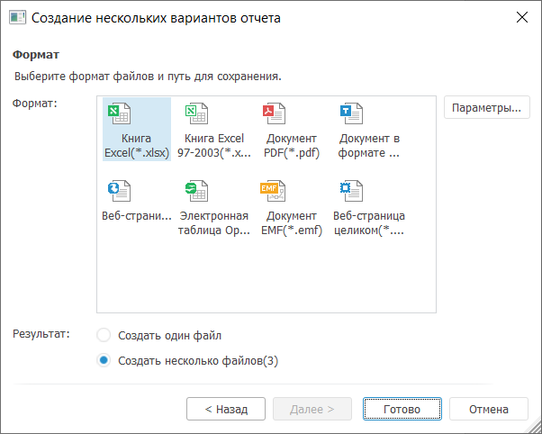

# Использование пакетных операций: Foresight Add-in for PowerPoint

Использование пакетных операций: Foresight Add-in for PowerPoint
-

# Использование пакетных операций

Пакетные операции - операции,
 выполняемые для нескольких вариантов отчета. Варианты отчета формируются
 по отметке элементов фиксированных измерений, которая задается с помощью
 элементов управления, общих для всех листов отчета.

Примечание.
 Если в источнике данных отсутствуют фиксированные измерения, то пакетные
 операции недоступны.

Количество вариантов отчета равно декартову произведению всех элементов,
 отмеченных в фиксированных измерениях. Например, в отчете существуют два
 элемента управления, общих для всех листов отчета. Если при выполнении
 пакетной операции для каждого измерения отметить по два элемента, то количество
 возможных пар, которые можно составить из этих элементов (т.е. декартово
 произведение) - четыре. Соответственно, будет сформировано четыре варианта
 отчета.

[Операции с элементами
 фиксированного измерения](javascript:TextPopup(this))

	При работе с элементами фиксированного измерения доступна следующая
	 операция:

		- Изменение отметки элементов.
		 Для работы с отметкой элементов измерения используйте команды
		 контекстного меню, описанные в разделе «[Изменение отметки в справочниках](uireport.chm::/desktop/Source/Dim/UiReport_Dim_Change_mark.htm)».

Доступны следующие пакетные операции:

	- пакетная печать;

	- [пакетный экспорт](Batch_Operations.htm#export).

## Пакетная печать

Для выполнения пакетной печати нажмите кнопку 
 «Пакетная печать», расположенную
 в группе «Пакетные операции» на
 вкладке «FORESIGHT» ленты инструментов.
 Будет открыт диалог «Печать нескольких
 вариантов отчета»:

В диалоге отображаются все фиксированные измерения. Задайте требуемую
 отметку и нажмите кнопку «Печать».

## Пакетный экспорт

Для выполнения пакетного экспорта нажмите кнопку «Пакетный экспорт», расположенную
 в группе «Пакетные операции» на
 вкладке «FORESIGHT» ленты инструментов.
 Будет открыт диалог «Создание
 нескольких вариантов отчета»:

В диалоге отображаются все фиксированные измерения. Задайте требуемую
 отметку.

Для выбора формата экспорта и пути для сохранения результатов нажмите
 кнопку «Далее»:

В диалоге отображаются доступные форматы экспорта и количество результирующих
 файлов. Выберете нужный формат. Для выбора параметров экспорта нажмите
 кнопку «Параметры», расположенную
 справа от панели выбора формата. Для каждого формата параметры экспорта
 различны.

Далее в зависимости от количества листов отчета будет предложено выбрать
 количество результирующих файлов. Наименования результирующих файлов формируются
 по следующему шаблону: <наименование
 файла>+(<комбинация элементов фиксированных измерений>)+.+<формат>.
 Например: Социально-экономические показатели
 (Данные регионов; Туризм).xls.

См. также:

[Построение
 презентации с использованием надстройки](../PowerPoint_Work.htm)

		Справочная
		 система на версию 10.9
		 от 18/08/2025,
		 © ООО «ФОРСАЙТ»,
