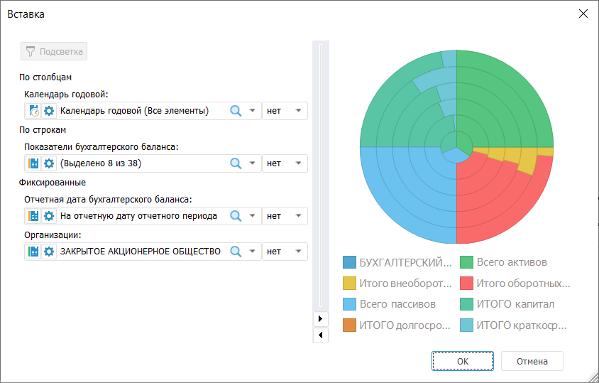
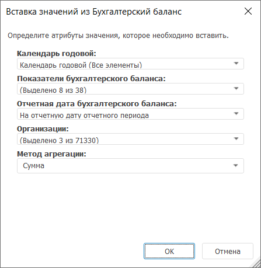
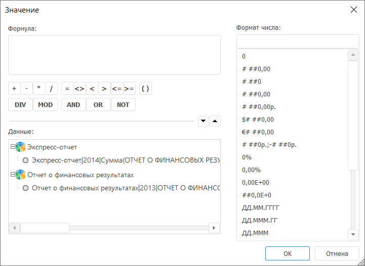

# Добавление объекта или отчёта из репозитория: Foresight Add-in for PowerPoint

Добавление объекта или отчёта из репозитория: Foresight Add-in for PowerPoint
-

# Добавление объекта или отчёта из репозитория

	При работе с надстройкой доступно добавление из репозитория:

		- отчётов:

			- экспресс-отчет;

			- рабочая книга;

			- регламентный отчет;

	Примечание.
	 В документ можно добавить только один отчёт из репозитория.

		- объектов:

			- Таблица. Отображает
			 данные из источника в табличном виде;

			- Диаграмма. Отображает
			 данные из источника в графическом виде;

			- [Карта](TableChart_Insert.htm#map).
			 Отображает данные из источника в виде карты территорий с детализацией
			 необходимых характеристик по отдельным регионам;

	Примечание.
	 Вставка карты доступна, если в отчете присутствуют другие объекты.

			- [Выражение](TableChart_Insert.htm#expression).
			 Элемент отчета, вычисляемый на основании данных их источника
			 или по формуле, заданной пользователем.

	Примечание.
	 В документ можно добавить несколько объектов.

	Закончив добавлять отчёт или объекты в документ, перейдите к шагу:

		- [Работа с объектом или отчётом
		 из репозитория](WorkWithObjects.htm);

		- [Использование
		 интерактивных элементов управления данными](WordAddin.chm::/Work/Controls/Controls_work.htm);

		- [Использование
		 пакетных операций](Batch_Operations/Batch_Operations.htm).

## Добавление отчётов

	В результате выбора отчёта из репозитория в окне выбора объекта,
	 в документ будет добавлен отчёт.

## Вставка таблицы/диаграммы

	Параметры вставки таблиц и диаграмм идентичны.

	После выбора источника данных отобразится окно «Вставка»:

	

	Окно содержит две области:

		- Область
		 измерений. Область содержит все измерения источника данных
		 и разделена на категории:

			- По столбцам.
			 Измерения, элементы которых располагаются по столбцам таблицы
			 данных;

			- По строкам.
			 Измерения, элементы которых располагаются по строкам таблицы
			 данных;

			- Фиксированные.
			 Измерения, элементы которых зафиксированы и не отображаются
			 в таблице;

		- Область таблицы/диаграммы.
		 В области отображена таблица/диаграмма для предварительного просмотра,
		 построенная по текущим параметрам измерений.

	Настройка измерения включает:

		- Тип измерения. Указан
		 пиктограммой:

			- . Календарное измерение;

			- . Измерение, основанное на справочнике;

			- . Измерение, основанное на справочнике
			 НСИ;

		- Параметры измерения.
		 Для настройки параметров измерения нажмите кнопку . Будет открыт диалог
		 «[Параметры измерения](uireport.chm::/desktop/Source/Dim/UiReport_Dim.htm)»;

		- Отметка измерения.
		 Для управления отметкой элементов измерения используйте раскрывающийся
		 список. Для работы с отметкой элементов измерения используйте
		 команды контекстного меню, описанные в разделе «[Изменение отметки в справочниках](uireport.chm::/desktop/Source/Dim/UiReport_Dim_Change_mark.htm)».
		 Для поиска элементов измерения нажмите кнопку 
		 «Поиск»;

		- Синхронизация отметки.
		 Синхронизация используется для установки одинаковой отметки элементов
		 в одинаковых измерениях различных источников данных. Для задания
		 синхронизации установите одинаковые индексы (# 1, # 2, # 3, и
		 т.д.) для измерений, отметка в которых должна изменяться синхронно:
		 при изменении отметки в одном измерении, она будет скопирована
		 в измерения с таким же индексом синхронизации. По умолчанию синхронизация
		 не используется и в списке индексов синхронизации выбран элемент
		 «Нет»;

		- Категория измерения.
		 Для изменения категории наведите указатель мыши на пиктограмму
		 измерения и зажмите кнопку мыши. Перетащите измерение в требуемую
		 категорию;

		- Оформление. Для
		 применения к таблице оформления из источника данных установите
		 флажок «Вставлять с оформлением».
		 Если флажок не установлен, то настройки оформления из источника
		 данных не будут применены к таблице.

### Особенности вставки таблицы

	Если на панели «Объекты отчета»
	 выделена диаграмма, то при нажатии на кнопку 
	 «Таблица» вставляется таблица
	 по той же отметке элементов измерений, что и диаграмма.

	При добавлении таблицы с большим количеством столбцов будет выдано
	 информационное сообщение о некорректном диапазоне вставляемой таблицы.

### Особенности вставки диаграммы

	Если на панели «Объекты отчета»
	 выделена таблица, то при нажатии на кнопку  «Диаграмма» вставляется диаграмма
	 по той же отметке элементов измерений, то и таблица.

## Вставка карты

	Вставка карты доступна, если в отчёте присутствуют источники данных.

	Для вставки карты нажмите кнопку «Карта», расположенную в группе «Вставка»
 на вкладке «FORESIGHT» ленты инструментов.
	 Будет отображен диалог для выбора топоосновы.

	После выбора топоосновы отображается диалог «[Свойства карты](uireport.chm::/desktop/Maps/UiMaps_Report_property.htm)»,
	 предназначенный для настройки параметров карты и отображаемых показателей.

### Требования к источнику данных для карты

	Источник данных для карты должен иметь территориальное измерение.
	 Данное измерение должно быть первым измерением, расположенным по строкам.

## Вставка выражения

	В зависимости от выбранного способа добавления выражения возможно:

		- Выражение
		 на основе данных из источника. Создание выражения на основе
		 данных из источника выполняется в диалоге «Вставка
		 значений из»:

	

	Диалог содержит:

			- Измерения источника
			 данных. Задайте отметку элементов, по которой будет
			 вычисляться выражение, выбрав элементы из раскрывающихся списков.
			 Для работы с отметкой элементов измерения используйте команды
			 контекстного меню, описанные в статье «[Изменение
			 отметки в справочниках](uireport.chm::/desktop/Source/Dim/UiReport_Dim_Change_mark.htm)»;

			- Метод агрегации.
			 Параметр доступен, если в одном из измерений задана множественная
			 отметка элементов. Выберите один из методов агрегации значений.
			 Доступные методы агрегации: сумма, минимум, максимум, количество
			 непустых, количество пустых, количество всех дочерних, арифметическое
			 среднее, фактическое среднее, первое фактическое, последнее
			 фактическое, среднеквадратическое отклонение на выборке, медиана,
			 среднеквадратическое отклонение, количество различных значений;

		- Выражение
		 на основе пользовательской формулы. Создание выражения
		 на основе пользовательской формулы выполняется в диалоге «Значение»:

	

	Диалог состоит из следующих областей:

			- Формула. Предназначена
			 для формирования формулы для расчёта выражения. В формуле
			 допускается использование любых арифметических операций, цифр,
			 знаков сравнения и круглых скобок. Формировать выражение можно
			 набором с клавиатуры, используя область данных и соответствующие
			 кнопки операторов.

			- Данные. Содержит
			 выражения на основе источников данных, созданные в текущем
			 отчёте. Существующие выражения можно использовать для составления
			 формулы расчёта пользовательского выражения. Для вставки существующего
			 выражения в формулу дважды щелкните по требуемому выражению.
			 Для сворачивания/разворачивания иерархии выражений выполните
			 команду «Свернуть всю иерархию»/«Развернуть всю иерархию»
			 в контекстном меню области.

			- Формат числа.
			 Предназначена для настройки формата результирующего значения.
			 Укажите требуемый формат из списка всех возможных форматов.

	[Удаление
	 объекта](javascript:TextPopup(this))

		Для удаления объекта:

			- выделите объект в отчете, затем:

				- выполните команду «Удалить
				 элемент управления содержимым» в контекстном меню
				 объекта;

				- нажмите клавишу DELETE;

			- выделите элемент, соответствующий объекту, на панели
			 «[Объекты
			 отчета](../AddIn_Mode.htm)» и выполните команду «Удалить»
			 в контекстном меню элемента.

См. также:

[Построение
 презентации с использованием надстройки](PowerPoint_Work.htm)

		Справочная
		 система на версию 10.9
		 от 18/08/2025,
		 © ООО «ФОРСАЙТ»,
