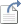
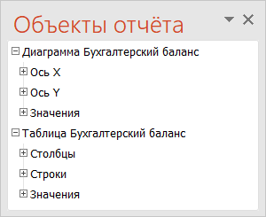
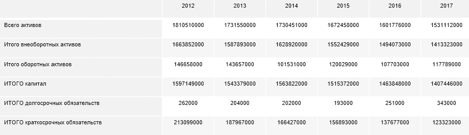
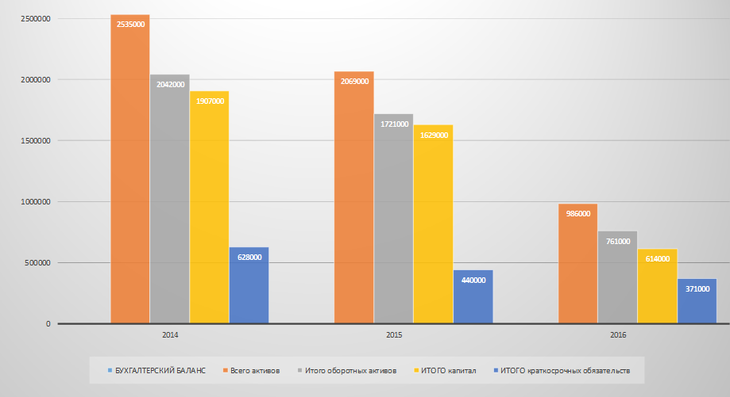
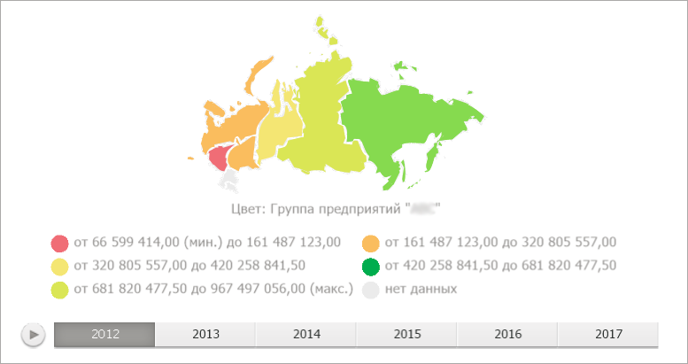
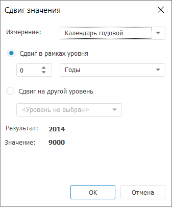
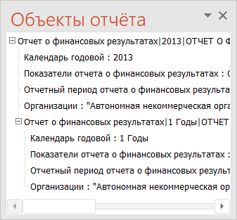

# Работа с объектом или отчётом из репозитория: Foresight Add-in for PowerPoint

Работа с объектом или отчётом из репозитория: Foresight Add-in for PowerPoint
-

# Работа с объектом или отчётом из репозитория

## Общие операции

	При работе с объектами и отчётами из репозитория доступны операции:

		- Обновление данных.
		 Для обновления данных во всех объектах в документе выполните команду
		  «Обновить»,
		 расположенную в группе «Отчёт»
		 на вкладке «FORESIGHT» ленты инструментов;

		- Настройка связи с источником
		 данных. Для отвязки всех объектов в документе от источников
		 данных нажмите кнопку  «Отвязать
		 от источника», расположенную в группе «Отчёт»
		 на вкладке «FORESIGHT» ленты инструментов.
		 В результате при обновлении данных в источнике они не будут обновлены
		 в документе. Документ будет содержать только стандартные объекты;

		- Экспорт. Для экспорта
		 отчета нажмите кнопку «Экспорт»,
		 расположенную в группе «Отчет»
		 на вкладке «FORESIGHT» ленты инструментов.
		 Будет открыт диалог сохранения файла. Доступные форматы экспорта
		 отчета: экспресс-отчет в формате PPEXPRESS (*.ppexpress), клиентский
		 куб (*.ppcube). Операция доступна при работе с экспресс-отчётом.

## Работа с объектами

	При добавлении в презентацию объектов отчёта работа с ними ведётся
	 с помощью панели «Объекты отчёта»:

	[Для отображения
	 панели](javascript:TextPopup(this))

		Для отображения/скрытия панели используйте кнопку  «Объекты
		 отчета», расположенную в группе «Вид»
		 на вкладке «Foresight»
		 ленты инструментов..

		Примечание.
		 Отображение панели недоступно, если в отчете отсутствуют объекты.

	

	Древовидная структура панели строится на основе измерений источников
	 данных объектов.

	Для переименования объекта выполните команду «Переименовать»
	 контекстного меню.

	Для таблиц и выражений доступна настройка формата отображаемых значений.
	 Для настройки формата используйте кнопки, расположенные в группе «Формат числа» на вкладке «FORESIGHT» ленты инструментов.

	При работе с объектами доступны стандартные операции Microsoft PowerPoint:

		- вставка;

		- редактирование данных;

		- настройка гиперссылки;

		- настройка формата;

		- изменение стиля;

		- настройка фона диаграммы;

		- изменение размера и т.д.

	Закончив работать с объектами отчёта, перейдите к шагу:

		- [использование интерактивных
		 элементов управления данными](Controls/Controls_work.htm);

		- [использование
		 пакетных операций](Batch_Operations/Batch_Operations.htm).

### Работа с таблицей

	Таблица - объект, предназначенный
	 для отображения данных из указанного источника в табличном виде. Пример
	 таблицы:

	

	На панели «Объекты отчёта»
	 название элемента, соответствующего таблице, по умолчанию формируется
	 по следующему правилу: Таблица <Наименование
	 источника данных>.

	Для элемента, соответствующего таблице, строится дерево измерений,
	 отображающее отметку элементов. Состав дерева:

		- Столбцы. Измерения
		 и элементы, расположенные по столбцам;

		- Строки. Измерения
		 и элементы, расположенные по строкам;

		- Значения. Фиксированные
		 измерения и элементы.

	[Особенности
	 построения дерева измерений](javascript:TextPopup(this))

		Если по строкам/столбцам или фиксировано:

			- Одно измерение.
			 Отображается список отмеченных элементов измерения;

			- Более,
			 чем одно измерение. Отображается название измерения
			 и список отмеченных элементов.

	Операции с таблицей:

	[Настройка
	 параметров таблицы](javascript:TextPopup(this))

		Для настройки параметров таблицы:

			- выполните команду «Редактировать»
			 в контекстном меню элемента, соответствующего таблице;

			- дважды щелкните по таблице в отчете.

		Будет отображен диалог «[Вставка](TableChart_Insert.htm)».

	[Фильтрация
	 данных](javascript:TextPopup(this))

		Для фильтрации данных в таблице используйте раскрывающееся меню
		 кнопки «Фильтр» в группе
		 «Таблица» на ленте инструментов.

	[Расчёт итоговых
	 значений](javascript:TextPopup(this))

		Итоговые значения могут быть рассчитаны для данных расположенных
		 в строках/столбцах. Для настройки параметров расчета итогов используйте
		 раскрывающееся меню кнопок «Итог
		 по столбцам»/«Итог по
		 строкам»/ в группе «Таблица»
		 на ленте инструментов.

	Операции, доступные для элементов, расположенных по строкам/столбцам:

	[Сортировка
	 элементов](javascript:TextPopup(this))

		Направление сортировки определяет переключатель, установленный
		 в контекстном меню элемента:

			- Не сортировать.
			 Используется по умолчанию. Сортировка значений не выполняется;

			- По возрастанию.
			 Сортировка выполняется по возрастанию значений;

			- По убыванию.
			 Сортировка выполняется по убыванию значений.

		Примечание.
		 Сортировка возможна только по значениям одного элемента в строке/столбце.

	[Добавление
	 вычисляемых элементов](javascript:TextPopup(this))

		Для добавления вычисляемого элемента выполните команду «Добавить» в контекстном меню
		 строк/столбцов. Будет отображен диалог «Размещение»,
		 параметры работы с которым описаны в разделе «[Настройка размещения](uireport.chm::/desktop/AreaData/Param/Order/UiReport_AreaData_Param_Order_Tuning.htm)».

	[Удаление
	 элемента](javascript:TextPopup(this))

		Для удаления выделенного элемента:

			- выполните команду «Удалить»
			 в контекстном меню элемента;

			- нажмите клавишу DELETE.

		Элемент будет удален без запроса подтверждения выполняемого
		 действия.

### Работа с диаграммой

	Диаграмма - объект, предназначенный
	 для отображения данных из указанного источника в графическом виде.
	 Например:

	

	На панели «Объекты отчёта»
	 название элемента, соответствующего диаграмме, по умолчанию формируется
	 по следующему правилу: Диаграмма<Наименование
	 источника данных>.

	Для элемента, соответствующего диаграмме, строится дерево измерений,
	 отображающее отметку элементов. Состав дерева:

		- Ось X. Измерения
		 и элементы, расположенные по столбцам;

		- Ось Y. Измерения
		 и элементы, расположенные по строкам;

		- Строки. Фиксированные
		 измерения и элементы.

	[Особенности
	 построения дерева измерений](javascript:TextPopup(this))

		Если по строкам/столбцам или зафиксировано:

			- Одно измерение.
			 Отображается список отмеченных элементов измерения;

			- Более, чем одно измерение.
			 Отображается название измерения и список отмеченных элементов.

	Операции с диаграммой:

	[Настройка
	 параметров диаграммы](javascript:TextPopup(this))

		Для настройки параметров диаграммы:

			- выполните команду «Редактировать»
			 в контекстном меню элемента, соответствующего диаграмме;

			- дважды щелкните по диаграмме в отчете.

		Будет отображен диалог «[Вставка](TableChart_Insert.htm)».

	[Удаление
	 элемента](javascript:TextPopup(this))

		Удалить возможно только элемент, расположенный по оси X/оси
		 Y.

		Для удаления выделенного элемента:

			- выполните команду «Удалить»
			 в контекстном меню элемента;

			- нажмите клавишу DELETE.

		Элемент будет удален без запроса подтверждения выполняемого
		 действия.

### Работа с картой

	Карта - объект, предназначенный
	 для отображения данных из источника в виде карты территорий с детализацией
	 необходимых характеристик по отдельным регионам. Например:

	

	На панели «Объекты отчёта»
	 название элемента, соответствующего карте, по умолчанию формируется
	 по следующему правилу: Карта<Порядковый
	 номер карты в отчете>.

	Операции с картой:

	[Настройка
	 параметров карты](javascript:TextPopup(this))

		Для настройки параметров карты:

			- выполните команду «Редактировать»
			 в контекстном меню элемента, соответствующего карте;

			- дважды щелкните по карте в отчете.

		Будет отображен диалог «[Свойства карты](uireport.chm::/desktop/Maps/UiMaps_Report_property.htm)».

	[Добавление/редактирование
	 шкалы](javascript:TextPopup(this))

		Шкала отчета - это набор правил, применяемых для визуального
		 оформления данных на карте. По умолчанию в отчете существует одна
		 цветовая шкала.

		Для просмотра информации о шкалах, доступных в отчете, выполните
		 команду «Добавить шкалу»
		 в контекстном меню элемента, соответствующего карте. Будет открыт
		 диалог «Шкалы отчета»:

		

		Диалог содержит список всех шкал. Для просмотра и редактирования
		 параметров шкалы выделите ее в списке.

		Для добавления шкалы нажмите кнопку «Добавить».
		 Отобразится раскрывающееся меню для выбора типа добавляемой шкалы:

			- Добавить [цветовую
			 шкалу](uireport.chm::/desktop/Reports/OperationReport/Scale/UiReport_Reports_Operation_Scale_Colorful.htm).
			 Используется для цветового оформления показателей карты;

			- Добавить [штриховую
			 шкалу](uireport.chm::/desktop/Reports/OperationReport/Scale/UiReport_Reports_Operation_Scale_Stroke.htm).
			 Используется для штрихового оформления показателей карты;

			- Добавить [числовую
			 шкалу](uireport.chm::/desktop/Reports/OperationReport/Scale/UiReport_Reports_Operation_Scale_Numeric.htm).
			 Используется в круговых/столбиковых показателях для определения
			 радиуса/ высоты частей диаграммы.

		Новая шкала будет добавлена в конец списка шкал.

		Для удаления выделенной шкалы нажмите кнопку «Удалить».
		 Будет запрошено подтверждение выполняемого действия.

### Работа с выражением

	Выражение - элемент отчета,
	 вычисляемый на основании данных из источника или по формуле, заданной
	 пользователем.

	На панели «Объекты отчёта»
	 название элемента, соответствующего выражению, по умолчанию формируется
	 по следующим правилам:

		- если выражение основано на источнике данных: <Наименование
		 источника данных>|<Отметка элементов измерений с указанием
		 метода агрегации>;

		- если выражение рассчитывается по пользовательской формуле:
		 Выражение <Порядковый номер
		 выражения>.

	Для выражения, основанного на источнике данных, отображается список
	 измерений и наименования отмеченных элементов.

	[Редактирование
	 выражения](javascript:TextPopup(this))

		Для редактирования выражения:

			- выполните команду контекстного меню «Редактировать»
			 элемента, соответствующего выражению;

			- дважды щелкните по выражению в отчете.

		В зависимости от типа выражения будет отображен диалог «[Вставка
		 значений из](TableChart_Insert.htm#expression_insert)» или «[Значение](TableChart_Insert.htm#expression_insertvalue)».

	Операции, доступные только для выражений, основанных на источнике
	 данных:

	[Вставка
	 в текст](javascript:TextPopup(this))

		В текст отчета могут быть вставлены:

			- значение, рассчитанное выражением;

			- отметка элементов измерения для источника данных выражения.

		Выполните команду контекстного меню «Вставить
		 в текст» элемента, соответствующего выражению или измерению
		 источника данных.

	[Создание
	 значения со сдвигом](javascript:TextPopup(this))

		Значение со сдвигом используется для получения значения выражения,
		 рассчитанного на другом временном интервале.

		Примечание.
		 Если для календарного измерения в выражении применяется агрегация,
		 то создание значения со сдвигом недоступно.

		Для создания значения со сдвигом выполните команду контекстного
		 меню «Создать значение со сдвигом»
		 элемента, соответствующего календарному измерению. Будет открыт
		 диалог «Сдвиг значения»:

		

		Задайте параметры:

			- Измерение. Укажите
			 календарное измерение для расчета сдвига значения;

			- Установите переключатель, определяющий параметры сдвига:

			-

				- Сдвиг в рамках
				 уровня. Сдвиг значения выполняется в рамках одного
				 уровня календаря на заданное количество периодов. Например,
				 на год вперед или на два квартала назад. В соответствующих
				 полях укажите уровень календаря и количество периодов
				 для сдвига;

				- Сдвиг на другой
				 уровень. Сдвиг значения с одного уровня на другой.
				 Например, с годового на квартальный. Укажите требуемый
				 уровень календаря.

		Для просмотра значений, получаемых в результате сдвига, предназначены
		 элементы:

			- Результат. Значение
			 календаря с учетом сдвига;

			- Значение. Значение
			 выражения с учетом сдвига.

		На панели «Объекты отчета»
		 значение со сдвигом отображается в виде дочернего элемента выражения.
		 Например:

		

		Операции, доступные для значения со сдвигом:

			- редактирование;

			- вставка в текст.

		Все операции выполняются аналогично операциям с выражением.

См. также:

[Построение
 презентации с использованием надстройки](PowerPoint_Work.htm)

		Справочная
		 система на версию 10.9
		 от 18/08/2025,
		 © ООО «ФОРСАЙТ»,
