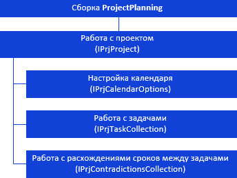
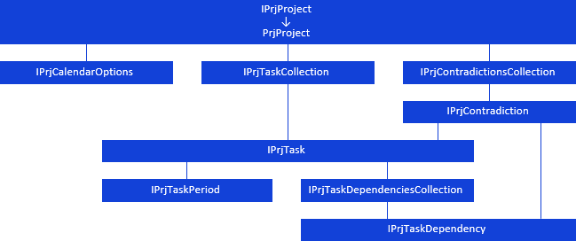

# Иерархия сборки ProjectPlanning

Иерархия сборки ProjectPlanning
-

# Иерархия сборки ProjectPlanning

Все классы и интерфейсы сборки ProjectPlanning
 можно разделить на группы.

[

Иерархия наследования и взаимодействия интерфейсов:

Примечание.
 Все названия классов/интерфейсов являются гиперссылками, для перехода
 к их описанию щелкните по ним мышью.

## Условные обозначения

		 
		 Класс_1
		 является потомком Интерфейса_1.

		 
		 Интерфейс_2
		 является потомком Интерфейса_1.

		 
		 Интерфейс_2
		 можно получить, используя свойства/методы Интерфейса_1.

См. также:

Введение
 в сборку ProjectPlanning](../Interface/IPrjProject/IPrjProject.htm)

		Справочная
		 система на версию 10.9
		 от 18/08/2025,
		 © ООО «ФОРСАЙТ»,
