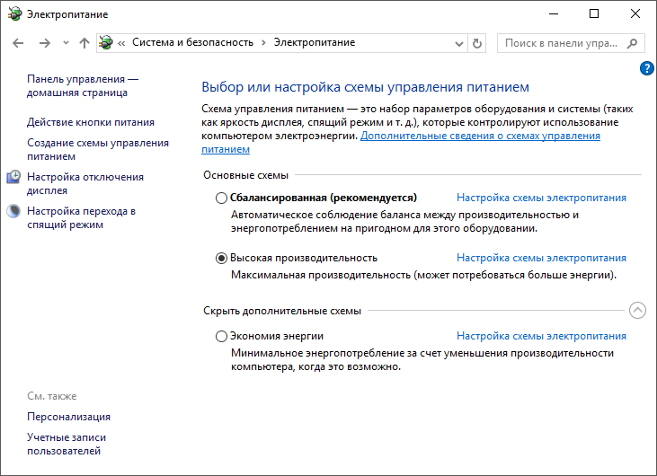

# Рекомендации по повышению производительности

Рекомендации по повышению производительности
-

# Рекомендации по повышению производительности

	Для повышения производительности продукта «Форсайт. Аналитическая платформа»
	 используйте настройки аппаратного и программного обеспечения.

## Настройка BI-кластера

	На базе нескольких BI-серверов продукта «Форсайт. Аналитическая платформа»
	 можно развернуть отказоустойчивый кластер. Для этого понадобится [балансировщик](../UiWebSetup/01_BIServer/Cluster/Cluster_Of_BI_Server.htm#balancer),
	 [сервер
	 состояний](../UiWebSetup/01_BIServer/StateServer/State_Server.htm) и несколько [BI-серверов](../03_DB_Server_Config/Setup_DB_ServerSysReq.htm#bi),
	 настроенных на работу с одним сервером состояний.

### Настройка BI-сервера

	Для повышения производительности BI-сервера на Apache2 настройте:

		- переменные окружения.
		 Для снижения пикового потребления памяти «Форсайт. Аналитическая платформа»
		 на ОС Linux добавьте дополнительные переменные окружения:

	PP_RETMEM=1

	MALLOC_MMAP_THRESHOLD_=8192

	PP_RETMEM_CO=1

	MALLOC_ARENA_MAX=1

	Примечание.
	 Использование переменной MALLOC_ARENA_MAX=1 может сократить потребление
	 памяти BI-сервером, но при этом возможно снижение производительности.
	 Проведите тестирование производительности прикладной системы при использовании
	 переменной.

		- количество рабочих потоков
		 в каждом процессе. Установите число рабочих потоков в рамках
		 одного экземпляра Apache2 не больше, чем удвоенное количество
		 пользователей, которые должны работать на данном экземпляре. Превышение
		 рекомендованного значения может привести к повышенному расходу
		 памяти, однако, слишком малое количество потоков может привести
		 к снижению производительности. Количество рабочих потоков в каждом
		 процессе рассчитывается индивидуально для каждой прикладной системы
		 на основании результатов нагрузочного тестирования.

### Настройка СУБД

	База данных и BI-сервер должны располагаться в одной локальной сети.
	 Иначе возможно сильное падение производительности из-за больших накладных
	 расходов на SQL-запросы.

	По умолчанию конфигурационный файл PostgreSQL/Postgres Pro идёт
	 с минимальными настройками. Увеличьте значения параметров max_connections, work_mem и
	 shared_buffers в соответствии с аппаратными характеристиками
	 сервера, на котором установлена СУБД. Установите значение параметра
	 max_connections в размере
	 суммы максимального количества в пулах соединений на каждом из узлов
	 кластера с запасом 25%.

	При работе с СУБД ClickHouse в строке подключения рекомендуется
	 указывать параметр STRINGMAXLENGTH, ограничивающий максимальный размер
	 строковых значений. Это позволяет уменьшить в оперативной памяти объем
	 буфера, который выделяется под получаемые данные, что в свою очередь
	 увеличит скорость выполнения запросов и благоприятно скажется на общей
	 производительности. Пример: Driver={ClickHouse ODBC Driver (Unicode)};Server=localhost;Database=default;UID=default;PWD=default;STRINGMAXLENGTH=8000.

## Настройка продукта «Форсайт. Аналитическая платформа»

	Продукт «Форсайт. Аналитическая платформа»
	 позволяет использовать преимущества SMP-систем и может использовать
	 все доступные ядра процессора. Запросы от пользователей выполняются
	 множеством потоков в рамках [сервера
	 приложений](../UiWebSetup/AppServer.htm). Потоки автоматически распределяются операционной системой
	 на доступные ядра процессора. Таким образом, выполняется распределение
	 вычислительной нагрузки.

### Лицензирование

	При входе в систему и работе с продуктом «Форсайт. Аналитическая платформа»
	 последовательно запрашиваются [единицы
	 лицензирования](../08_Licensing/AboutFeatures.htm). Для ускорения обращений к серверу лицензий на
	 базе RMS:

		- укажите конкретный адрес сервера лицензий для поиска [сетевой лицензии](../08_Licensing/Admin_Licensing_Variants.htm)
		 в ОС Windows:

			- создайте системную переменную [LSFORCEHOST](../08_Licensing/RMS/LicenseServer.htm#lshost)
			 и задайте адрес сервера лицензий в качестве значения переменной;

			- установите переключатель «Поиск
			 лицензий на сервере» в окне «[Настройки
			 поиска лицензии](../08_Licensing/RMS/Intro_LicMngr_SearchLic.htm)» и задайте адрес сервера лицензий
			 в соответствующем поле;

	Примечание.
	 Системная переменная LSFORCEHOST приоритетнее окна «[Настройки
	 поиска лицензий](../08_Licensing/RMS/Intro_LicMngr_SearchLic.htm)».

		- используйте [сервис
		 лицензирования](../08_Licensing/Service/Licensing_Service.htm) для распараллеливания запросов сетевых лицензий
		 от BI-сервера к серверу лицензий;

		- минимизируйте количество подключаемых внешних накопителей
		 на компьютере с BI-сервером, таких как USB-флеш, USB-HDD, CD-ROM
		 и других. При работе с лицензиями осуществляется получение списка
		 всех подключенных устройств и обращение к ним.

### Администрирование

	При администрировании продукта «Форсайт. Аналитическая платформа»
	 в [менеджере
	 безопасности](admin.chm::/01_RunSecManager/Admin_Organizational_Starting.htm):

		- установите флажок «[Создавать субъекты с отложенной загрузкой](Admin.chm::/03_Admin/Access_control_settings.htm#create_subjects)»
		 для ускорения загрузки данных субъектов безопасности, если в системе
		 содержится более двухсот субъектов;

		- разграничивайте [права
		 доступа](admin.chm::/02_ComonFunction/Admin_SecManager_CommonFunction.htm) к объектам через [группы пользователей](admin.chm::/03_Admin/Groups/Admin_Groups.htm).
		 Если предполагается настраивать права доступа для более двухсот
		 групп, то используйте [дискреционный
		 метод разграничения доступа](admin.chm::/04_SecurityPolicy/Admin_PermSep_D.htm) совместно с [атрибутным](admin.chm::/04_SecurityPolicy/Admin_ABAC.htm).

	Если используется [доменная](../UiWebSetup/Authentication/Authentication.htm#domain)
	 или [интегрированная
	 доменная аутентификация](../UiWebSetup/Authentication/Authentication.htm#integrated_domain), то создавайте доменные группы без явного
	 добавления каждой учётной записи пользователей.

	Примечание.
	 [Поддержка
	 доменных групп](../03_DB_Server_Config/Postgres_server_preparation.htm#domain) доступна, если на уровне СУБД содержатся группы
	 в виде ролей и пользователи, входящие в эти роли.

### Работа с объектами репозитория

	Для работы с объектами репозитория:

		- установите флажок «[Автоматическое
		 подключение](UiNavObj.chm::/database/UiDb_database_master_property.htm)» в свойствах базы данных
		 и задайте имя пользователя и пароль в соответствующих полях, если
		 для [подключения
		 к репозиторию](../06_AK_Client_Config/UiNav_RepoConfig_repo1.htm) используется [доменная](../UiWebSetup/Authentication/Authentication.htm#domain)
		 или [интегрированная
		 доменная аутентификация](../UiWebSetup/Authentication/Authentication.htm#integrated_domain), и снят флажок «[Переопределить
		 настройки подключения к БД](UiNavObj.chm::/database/UiDb_database_master_property.htm)» в свойствах
		 базы данных. Таким образом, при открытии реляционных объектов
		 будет сокращено время подключения к базе данных, из которой загружаются
		 данные;

		- установите флажок «[Отложенная
		 загрузка дескрипторов объектов](../06_AK_Client_Config/UiNav_RepoConfig_repo1.htm#delayed_loading)» в настройках подключения
		 к репозиторию, если репозиторий содержит большое количество объектов.
		 Таким образом, при подключении будут загружаться дескрипторы только
		 тех объектов, которые необходимы для работы в репозитории;

	Примечание.
	 Отложенная загрузка дескрипторов ускоряет вход в систему только в
	 настольном приложении. При работе с веб-приложением не рекомендуется
	 использовать отложенную загрузку.

		- установите флажок «[Кеширование
		 системных таблиц при старте сервера](../06_AK_Client_Config/UiNav_RepoConfig_repo1.htm)» в настройках подключения
		 к репозиторию. Кеширование позволяет увеличить производительность
		 системы и скорость открытия сложносоставных отчётов, использующих
		 множество источников данных, в веб-приложении за счёт сокращения
		 времени чтения системных таблиц из базы данных;

	Важно.
	 Кеширование системных таблиц метаданных допустимо только в промышленной
	 эксплуатации. При использовании кеширования не должны изменяться данные
	 в системных таблицах метаданных.

		- убедитесь, что при настройке размещения элементов в [таблице](UiAnalyticalArea.chm::/Table.htm)
		 не используется [автоподгонка
		 ячеек](UiAnalyticalArea.chm::/TableView/Layout/Layout.htm). Задайте высоту ячейки вручную с помощью
		 свойства [ITabSheet.DefaultHeight](TabSheet.chm::/Interface/ITabSheet/ITabSheet.DefaultHeight.htm),
		 ширину ячейки - [ITabSheet.DefaultWidth](TabSheet.chm::/Interface/ITabSheet/ITabSheet.DefaultWidth.htm).
		 Размер ячеек будет использоваться по умолчанию при создании новых
		 строк и столбцов;

		- учитывайте [особенности
		 работы с таблицей](tabsheet.chm::/working_with_table.htm) в среде разработки «Форсайт. Аналитическая платформа».

### Работа с расширениями

	Если [установлены
	 расширения продукта](Setup.chm::/Extensions/install_or_update_extensions.htm), то для повышения производительности:

		- убедитесь, что при работе с [реестровой
		 формой](DataEntryForms.chm::/desktop/Starting/ConstructForm.htm#registry) в расширении «[Интерактивные
		 формы ввода данных](DataEntryForms.chm::/DataEntryForms_Purpose.htm)» все измерения кубов,
		 созданных автоматически, [привязаны](UiNavObj.chm::/Cube/CreateCube/Master_Standart/UiMd_Cube_CreateCube_Master_Standart_3.htm#dims_binding)
		 к полям источников данных;

		- используйте виртуальные ячейки и настраивайте размер ячеек
		 вручную в расширении «[Интерактивные
		 формы ввода данных](DataEntryForms.chm::/DataEntryForms_Purpose.htm)»:

			- установите флажок «[Использовать виртуальные ячейки](DataEntryForms.chm::/desktop/Table/Basic_Properties.htm)»
			 в мастере табличной области;

			- убедитесь, что в мастере
			 табличной области не задана [автоподгонка
			 ячеек](DataEntryForms.chm::/desktop/Table/Basic_Properties.htm). Задайте высоту ячейки вручную с
			 помощью свойства [ITabSheet.DefaultHeight](TabSheet.chm::/Interface/ITabSheet/ITabSheet.DefaultHeight.htm),
			 ширину ячейки - [ITabSheet.DefaultWidth](TabSheet.chm::/Interface/ITabSheet/ITabSheet.DefaultWidth.htm).
			 Размер ячеек будет использоваться по умолчанию при создании
			 новых строк и столбцов;

		- используйте условный оператор [?:](fore.chm::/08_operators/Fore_If.htm)
		 вместо функции [Iif](UiNav.chm::/GUI/Function/Logical/Func_Logical_Iif.htm)
		 при настройке [формул
		 расчёта](CalculationAlgorithm.chm::/desktop/Calculation_block/Formula.htm) в расширении «[Алгоритмы
		 расчёта](CalculationAlgorithm.chm::/Purpose.htm)»;

		- запускайте выполнение бизнес-процессов, построенных в расширении
		 «[Управление бизнес-процессами](BPM.chm::/Modeling_of_business_processes.htm)», в отдельном потоке
		 с помощью метода [IForeThread.Start](kefore.chm::/interface/iforethread/iforethread.start.htm)
		 при разработке приложений.

### Логирование

	Отключите [логирование](knowledgebase.chm::/01_fore/kb000030/knowledgebase_kb000030_1.htm)
	 «Форсайт. Аналитическая платформа»
	 или скройте вывод отладочной информации:

		- Создайте раздел «Log»
		 в ветке реестра [HKEY_LOCAL_MACHINE\Software\Foresight\Foresight Analytics Platform\10.0].

		- В разделе создайте параметр WriteToDebugOutput
		 типа REG_DWORD со значением «0».

### Пул соединений

	[Пул соединений](../UiWebSetup/01_BIServer/PoolConnections.htm)
	 ограничивает количество соединений между экземпляром BI-сервера и
	 СУБД. По умолчанию лимит пула соединений установлен 50. Установите
	 лимит пула вручную в нужное значение в зависимости от потребностей
	 прикладной системы. Настройка пула читается каждым процессом BI-сервера
	 отдельно.

### Время ожидания до прерывания сессии

	Задайте [время
	 ожидания при отсутствии запросов](../UiWebSetup/03_Setup_Web/BI_Server_Registry_Key.htm#timeoutsec), по истечении которого сессия
	 с репозиторием будет разорвана, с помощью параметра TimeoutSec
	 в подразделе реестра [HKLM\SOFTWARE\Foresight\Foresight Analytics Platform\10.0\PP\BIS\System\Session].
	 Использование больших значений времени может привести к повышенному
	 потреблению памяти, использование бесконечного значения «-1», может
	 привести к утечкам памяти.

### Взаимодействие с антивирусной программой

	Если антивирусная программа устанавливается на сервера, которые
	 обеспечивают поддержку [контура
	 промышленной эксплуатации](../GeneralInfo.htm#cluster) (кластер веб-серверов, балансировщики
	 нагрузки, кластер BI-серверов, сервер состояний, сервер приложений,
	 сервер лицензий, кластер сервисов лицензирования, сервер СУБД), то
	 производительность системы может снизиться из-за особенностей работы
	 антивирусной программы. Вследствие чего наблюдаются задержки при выполнении
	 операций, связанных с файловым и сетевым вводом-выводом. Для повышения
	 производительности системы обратитесь к рекомендациям производителя
	 средств антивирусной защиты. Например, рекомендации для Kaspersky
	 Endpoint Security версии 12 указаны в [документации
	 Kaspersky](https://support.kaspersky.ru/kes-for-linux/12.1.0/install/16099#block10).

	При настройке антивирусной программы исключите из проверок компоненты
	 «Форсайт. Аналитическая платформа»:

		- в ОС Linux:

			- папка установки BI-сервера /opt/foresight/fp10.x-biserver;

			- папка установки серверной части веб-приложения /opt/foresight/fp10.x-webserver;

			- папка, содержащая конфигурационный файл экземпляра веб-сервера
			 envvars, /etc/opt/foresight/fp10.x-webserver;

			- папка, содержащая конфигурационные файлы экземпляра
			 Apache2 с BI-сервером: /etc/apache2-fp10.x в Debian-подобных
			 дистрибутивах, /etc/httpd-fp10.x в RedHat-подобных
			 дистрибутивах, /etc/httpd2-fp10.x в ALT Linux;

			- папка, содержащая конфигурационные файлы экземпляра
			 Apache2 с серверной частью веб-приложения: /etc/apache2-fp10.x-web
			 в Debian-подобных дистрибутивах, /etc/httpd-fp10.x-web
			 в RedHat-подобных дистрибутивах, /etc/httpd2-fp10.x-web
			 в ALT Linux;

		- в ОС Windows:

			- папка установки BI-сервера C:\Program Files\Foresight\Analytics Platform
			 10.x;

			- папка установки веб-приложения C:\Program Files (x86)\Foresight\Analytics Platform
			 10.x
			 Web Application;

			- папка, содержащая файл [settings.xml](../UiWebSetup/03_Setup_Web/BI_Server_Settings_XML.htm),
			 C:\ProgramData\Foresight\Foresight Analytics Platform;

			- папка хранения кеша C:\Users\<имя
			 пользователя>\AppData\Local\Foresight\Foresight Analytics Platform.

	Убедитесь, что процессы, которые использует «Форсайт. Аналитическая платформа»,
	 не сканируются в постоянном режиме. К процессам относятся: BI-сервер,
	 веб-сервер, сервер лицензий, планировщик задач. Также учитывайте,
	 что «Форсайт. Аналитическая платформа»
	 может использовать другие процессы, запускаемые пользователем, например,
	 при выполнении прикладного кода на Fore или при подключении дополнительных
	 модулей: Python, Java, R и других.

## Настройка ОС Windows

	Для увеличения скорости работы продукта «Форсайт. Аналитическая платформа»
	 в ОС Windows:

		- Отройте панель управления Windows.

		- Перейдите в раздел «Электропитание»
		 в категории «Система и безопасность».

		- Установите переключатель «Высокая
		 производительность»:

	

	После выполнения действий будет увеличена скорость работы продукта
	 «Форсайт. Аналитическая платформа».

	Убедитесь, что средства отладки и профайлинга: Intel Vtune, DebugDiag,
	 AppVerifier, Valgrind, а также антивирусные программы, не используются
	 на серверах в контуре промышленной эксплуатации.

См. также:

[Установка
 и настройка продукта «Форсайт. Аналитическая платформа»](../Setup_TitlePage.htm)

		Справочная
		 система на версию 10.9
		 от 18/08/2025,
		 © ООО «ФОРСАЙТ»,
