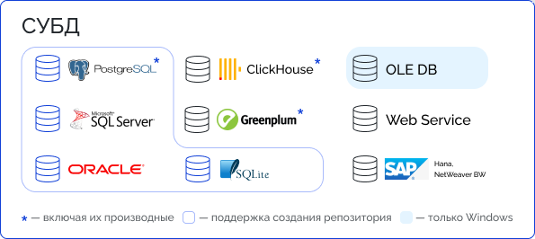

# Поддерживаемые СУБД

Поддерживаемые СУБД
-

# Поддерживаемые СУБД

При работе «Форсайт. Аналитическая платформа»
 обращается к серверу СУБД для доступа к данным репозитория. Обращение
 происходит с использованием клиентской части СУБД или через какие-либо
 дополнительные драйверы, предоставляющие доступ к СУБД. Для работы с разными
 версиями СУБД также могут быть использованы различные версии драйверов.

Ниже приведен список СУБД, с которыми поддерживается работа платформы:

[

## СУБД для подключения к репозиторию

Версия СУБД автоматически снимается с поддержки в «Форсайт. Аналитическая платформа»
 по истечении срока её официальной поддержки. Для обеспечения стабильной
 работы рекомендуется заранее планировать переход на актуальные версии
 СУБД.

		 Тип СУБД
		 Описание
		 Комментарии

		 ](#postgresql)PostgreSQL/Postgres
		 Pro

		 Поддерживается работа с СУБД PostgreSQL/Postgres Pro версий:
		 13.0-13.15\14.0-14.12\15.0-15.7\16.0-16.1\17.0-17.4.

		Сроки поддержки версий СУБД указаны на [официальном
		 сайте PostgreSQL](https://www.postgresql.org/support/versioning/).

		 Требуется установка какого-либо приложения, содержащего
		 драйвер для подключения к PostgreSQL, это может быть:

			- отдельный ODBC драйвер (рекомендуется);

			- серверная часть СУБД PostgreSQL;

			- какие-либо другие коммерческие приложения или приложения
			 с открытым исходным кодом, разрабатываемые и поставляемые
			 для работы с PostgreSQL.

		Для корректного подключения к СУБД PostgreSQL/Postgres Pro разрядности
		 «Форсайт. Аналитическая платформа»
		 и устанавливаемого драйвера должны совпадать. Различные версии
		 драйверов доступны на официальном сайте [PostgreSQL](https://www.postgresql.org/ftp/odbc/releases/).

		При работе в ОС Windows после установки драйвера добавьте в
		 системную переменную PATH путь до папки «bin», в которой содержатся
		 библиотеки драйвера. Например, «c:\Program Files\psqlODBC\0905\bin\».

		При работе в ОС Astra Linux SE поддерживается версия СУБД PostgreSQL,
		 входящая в состав дистрибутива операционной системы.

		 Oracle

		 Поддерживается работа с СУБД Oracle версий: 12.x\18.x.

		 Требуется установка клиентской части СУБД.

		Для корректного подключения к СУБД Oracle разрядности «Форсайт. Аналитическая платформа»
		 и клиентской части СУБД Oracle должны совпадать.

		Работа с Oracle 12.x не поддерживается, если при установке серверной
		 части была включена опция для поддержки технологии Oracle Multitenant.

		Клиентская часть и инструкция по установке доступны на официальном
		 сайте [Oracle](https://www.oracle.com/database/technologies/instant-client/downloads.html).

		При установке и настройке серверной и клиентских частей необходимо
		 учитывать языковые настройки, которые будут использоваться при
		 передаче и хранении данных. Более подробно о языковых настройках,
		 параметре NLS_LANG и способах его задания читайте на [сайте разработчика](https://www.oracle.com/database/technologies/faq-nls-lang.html).

		Примечание.
		 Не рекомендуется использовать настройки, в которых используется
		 переменная длина кодирования символов - UTF8 и UTF16.

		 Microsoft SQL Server

		 Поддерживается работа с СУБД Microsoft SQL Server версий:
		 2014\2016\2019.

		 Требуется установка клиентской части СУБД (Native Client).
		 Поддерживается подключение через интерфейсы OLE DB и ODBC.

		Клиентская часть и инструкция по установке доступны на официальном
		 сайте [Microsoft](https://docs.microsoft.com/ru-ru/sql/linux/sql-server-linux-setup?view=sql-server-ver15).

		Примечание.
		 Версия клиентской части должна быть не ниже версии сервера СУБД.

		 SQLite

		 Поддерживается работа с СУБД SQLite версии 3.x.

		 Необходимый драйвер входит в комплект поставки выбранного
		 [дистрибутива](../02_AK_Install/DistributionKit.htm#32_and_64)
		 «Форсайт. Аналитическая платформа».

		Примечание.
		 Работа с продуктом «Форсайт. Аналитическая платформа»
		 доступна только в настольном приложении в однопользовательском
		 режиме.

При возникновении проблем во время создания репозитория или при подключении
 к репозиторию обратитесь к подразделу «[Решение возможных проблем с продуктом
 «Форсайт. Аналитическая платформа](FAQ.chm::/FAQ_title.htm)».

Примечание.
 При работе в ОС Linux необходимо учитывать имеющиеся [ограничения](../UiWebSetup/03_Setup_Web/Linux_constraints.htm).

## Дополнительные возможности подключения

Кроме подключения к серверу СУБД в «Форсайт. Аналитическая платформа»,
 реализован ряд альтернативных драйверов, позволяющих подключаться к источникам
 данных. Подключение осуществляется через объект репозитория «[База данных](UiNavObj.chm::/database/UiDb_database.htm)».

		 Тип драйвера
		 Описание
		 Комментарии

		 Greenplum/Pivotal HD
		 Hawq/Arenadata DB

		 Поддерживается подключение к источникам данных на базе программно-аппаратного
		 комплекса EMC Greenplum и СУБД PostgreSQL/Postgres Pro.

		Примечание.
		 Не используется для подключения к репозиторию.

		 Требуется установка ODBC драйвера в операционной системе.

		Драйвер Greenplum позволяет работать с базами данных, созданными
		 на сервере СУБД PostgreSQL/Postgres Pro, в режиме чтения без поддержки
		 [типа
		 данных Lo](../03_DB_Server_Config/Postgres_server_preparation.htm#lo_data_type). В таком случае установка ODBC драйвера не требуется.

		 ClickHouse
		 Поддерживается подключение посредством драйверов ODBC, установленных
		 в OC Windows или OC Linux. В веб-приложении доступно подключение
		 к [базе
		 данных](UiNavObj.chm::/database/UiDb_database_master_property.htm) СУБД ClickHouse напрямую.

		Примечание.
		 Не используется для подключения к репозиторию.

		 ODBC драйвер доступен на официальном сайте [ClickHouse](https://github.com/ClickHouse/clickhouse-odbc).
		 Подключение аналогично Generic ODBC.

		При установке драйвера в папку библиотек скопировать ANSI и
		 Unicode версии драйвера. При работе с платформой использовать
		 Unicode версию драйвера ODBC - clickhouseodbcw.so.

		Ограничения при работе с ODBC драйвером:

			- доступно создание стандартных кубов, поддерживается
			 извлечение изменённых данных, серверная агрегация данных,
			 [использование
			 ползапросов при извлечении данных](UiNavObj.chm::/Cube/CreateCube/Master_Standart/UiMd_Cube_CreateCube_Master_Standart_2.htm#subqueries);

			- не поддерживается создание таблиц и вставка данных;

			- не поддерживается создание хранимых процедур/функций,
			 а также триггеров для таблиц;

			- с СУБД не смогут работать следующие объекты репозитория:
			 автоматические кубы, многомерный расчёт на сервере БД, база
			 данных временных рядов.

		Ограничения при работе с СУБД ClickHouse напрямую:

			- доступно создание таблиц, запросов, присоединённых таблиц,
			 представлений, команд СУБД, функций. Созданные таблицы могут
			 использоваться в качестве источников данных для табличных
			 справочников;

			- не поддерживается создание хранимых процедур, а также
			 триггеров для таблиц;

			- с СУБД не смогут работать следующие объекты репозитория:
			 любой тип куба, справочник НСИ, составной справочник НСИ,
			 многомерный расчёт на сервере БД, база данных временных рядов.

		 OLE DB

		 Поддерживается подключение к различным источникам данных
		 посредством OLE DB провайдеров, установленных в операционной системе.
		 Для упрощения настройки в «Форсайт. Аналитическая платформа»
		 выделен ряд провайдеров:

			- OLE DB (ODBC HIVE);

			- OLE DB (ODBC).

		Примечание.
		 Не используются для подключения к репозиторию.

		 Требуется установка OLE DB драйверов в операционной системе.

		Поддерживается выполнение только запросов, команд СУБД. Создание
		 и использование таблиц, представлений, процедур и функций поддерживается
		 в зависимости от возможностей конкретной СУБД и её соответствия
		 стандартам SQL.

		 WEB Service

		 Подключение к репозиторию осуществляется путём обращения
		 к BI-серверу, который выполняет все необходимые функции по авторизации
		 в СУБД и последующему управлению потоком с данными.

		 Не требуется установка клиентской части СУБД на компьютер
		 пользователя. Все необходимые драйверы должны быть установлены
		 там, где расположен BI-сервер.

		Примечание.
		 Работа с продуктом «Форсайт. Аналитическая платформа»
		 доступна только в настольном приложении.

		 Generic ODBC

		 Поддерживается подключение к различным источникам данных
		 посредством драйверов ODBC, установленных в операционной системе.

		Примечание.
		 Не используется для подключения к репозиторию.

		 Требуется установка ODBC драйверов в операционной системе.

		Поддерживается выполнение только запросов, команд СУБД. Создание
		 и использование таблиц, представлений, процедур и функций поддерживается
		 в зависимости от возможностей конкретной СУБД и её соответствия
		 стандартам SQL.

		Может использоваться для подключения к поддерживаемым СУБД (PostgreSQL/Postgres
		 Pro, Oracle и другим), источникам данных (Greenplum, SAP и другим)
		 посредством указания DSN или формирования строки подключения.
		 Необходимый ODBC драйвер можно получить у соответствующего производителя.

		Например, для подготовки и подключения ODBC драйвера к Microsoft
		 SQL Server обратитесь к [документации Microsoft](https://learn.microsoft.com/ru-ru/sql/connect/odbc/microsoft-odbc-driver-for-sql-server?view=sql-server-ver16),
		 MySQL - к [документации MySQL](https://dev.mysql.com/doc/connector-odbc/en/connector-odbc-installation.html).

См. также:

[Системные
 требования к серверу баз данных](../03_DB_Server_Config/Setup_DB_ServerSysReq.htm) | [Системные
 требования](SystemRequirement.htm)

		Справочная
		 система на версию 10.9
		 от 18/08/2025,
		 © ООО «ФОРСАЙТ»,
